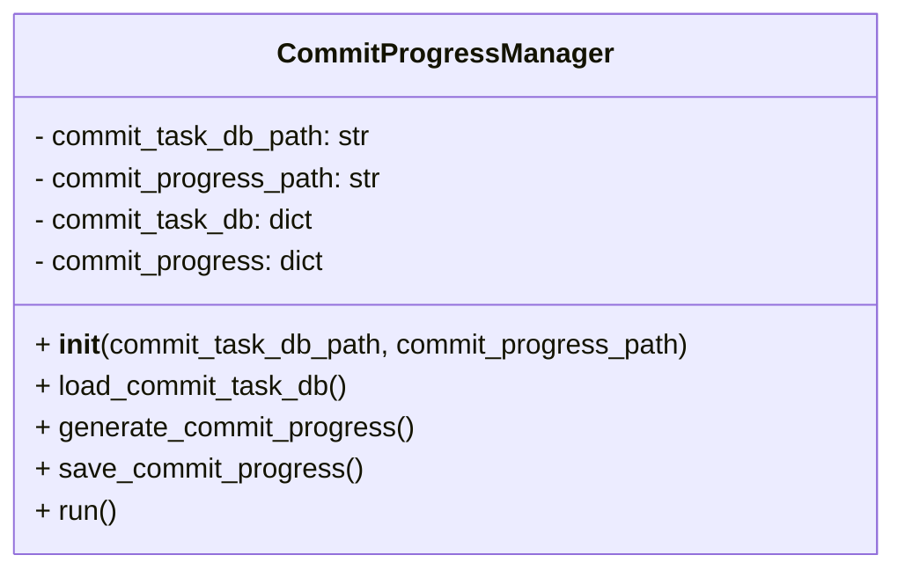
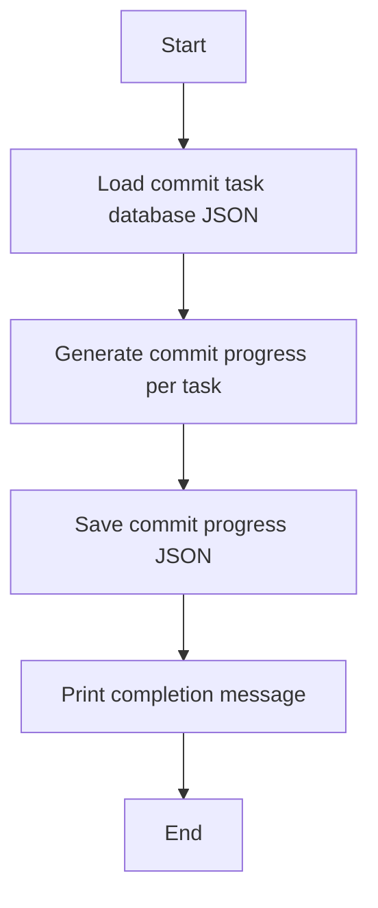

# Commit Progress Manager Module

## Overview
The `commit_progress_manager` module provides the `CommitProgressManager` class to track and manage commit progress per task. It loads commit task data, calculates commit counts and progress percentages, and saves the progress data.

## Class: CommitProgressManager

### Description
The `CommitProgressManager` class manages commit progress tracking by reading commit task database JSON, generating progress metrics, and saving the results.

### Methods

- `__init__(self, commit_task_db_path, commit_progress_path)`
  - Initializes paths and internal data structures.

- `load_commit_task_db(self)`
  - Loads commit task database JSON from file.

- `generate_commit_progress(self)`
  - Calculates commit counts, last commit dates, and progress percentages per task.

- `save_commit_progress(self)`
  - Saves the generated commit progress data to JSON file.

- `run(self)`
  - Runs the full process: load, generate, save, and print status.

## Usage
The module can be run as a script to update commit progress data:

```python
if __name__ == "__main__":
    manager = CommitProgressManager()
    manager.run()
```

## Diagrams

### Mermaid Class Diagram



### Mermaid Commit Progress Flowchart



---

## Credits

This module uses Python's built-in `json` and `datetime` modules for data handling and processing.

---

This documentation provides a detailed overview of the `commit_progress_manager` module to assist developers in understanding and using its functionality effectively.
