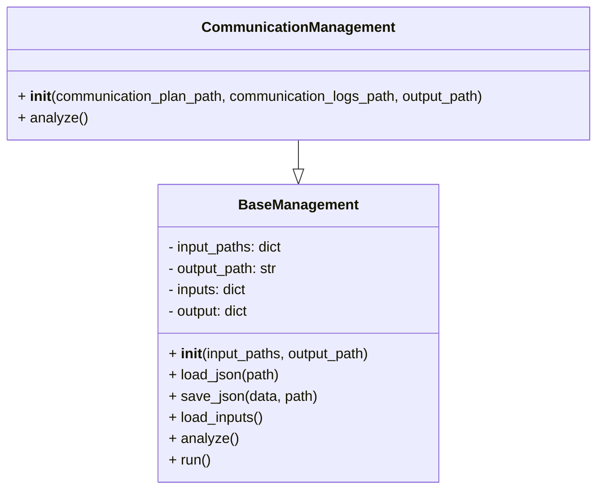
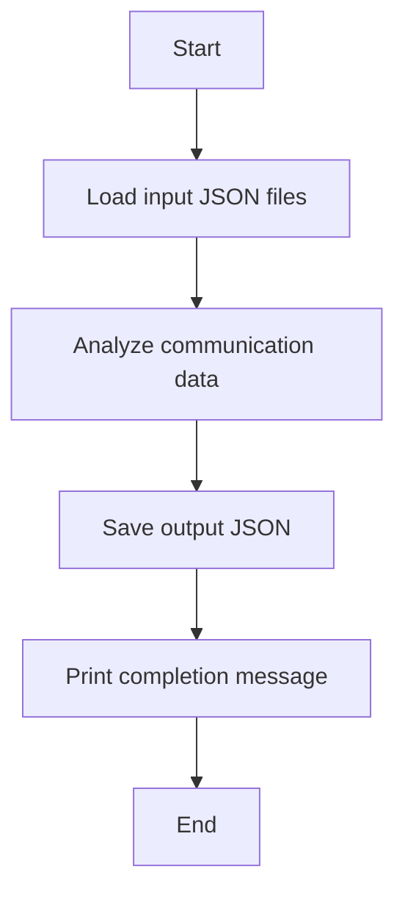

# Communication Management Module

## Overview
The `communication_management` module provides the `CommunicationManagement` class to analyze communication plans and logs. It loads input JSON files, performs analysis (currently a placeholder), and saves the output JSON.

## Classes

### BaseManagement
A base class providing common functionality for loading inputs, saving outputs, and running analysis.

- `__init__(self, input_paths: dict, output_path: str)`
  - Initializes input and output paths.
- `load_json(self, path)`
  - Loads JSON data from a file.
- `save_json(self, data, path)`
  - Saves JSON data to a file.
- `load_inputs(self)`
  - Loads all input JSON files.
- `analyze(self)`
  - Abstract method to be implemented by subclasses.
- `run(self)`
  - Runs the full process: load inputs, analyze, save output.

### CommunicationManagement (inherits BaseManagement)
- `__init__(self, communication_plan_path, communication_logs_path, output_path)`
  - Initializes with default paths for communication plan and logs.
- `analyze(self)`
  - Placeholder method for communication analysis logic.
  - Currently outputs a summary indicating analysis is not yet implemented.

## Usage
The module can be run as a script to perform communication management analysis:

```python
if __name__ == "__main__":
    manager = CommunicationManagement()
    manager.run()
```

## Diagrams

### Mermaid Class Diagram



### Mermaid Process Flowchart



---

## Credits

This module uses Python's built-in `json` and `os` modules for file handling and data processing.

---

This documentation provides a detailed overview of the `communication_management` module to assist developers in understanding and using its functionality effectively.
