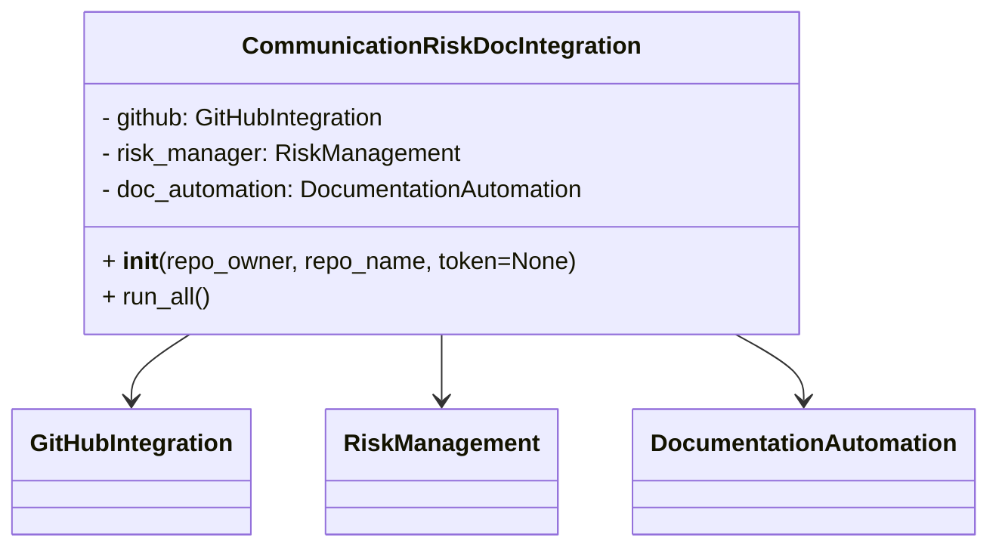
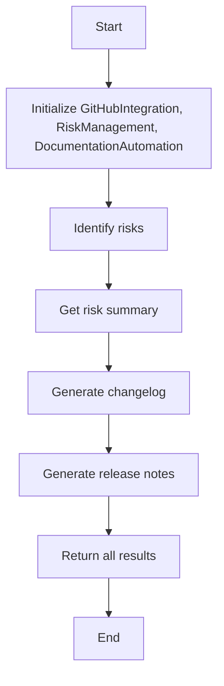

# Communication Risk Doc Integration Module

## Overview
The `communication_risk_doc_integration` module integrates GitHub data, risk management, and documentation automation to provide a comprehensive overview of project risks and release documentation.

## Class: CommunicationRiskDocIntegration

### Description
The `CommunicationRiskDocIntegration` class combines functionalities from:
- `GitHubIntegration` for accessing GitHub repository data.
- `RiskManagement` for identifying and summarizing risks.
- `DocumentationAutomation` for generating changelogs and release notes.

### Methods

- `__init__(self, repo_owner, repo_name, token=None)`
  - Initializes the integration with GitHub repository details and optional token.

- `run_all(self)`
  - Executes risk identification, risk summary retrieval, changelog generation, and release notes generation.
  - Returns a dictionary containing risks, risk summary, changelog, and release notes.

## Usage
The module can be run as a script to perform the integrated operations:

```python
if __name__ == "__main__":
    repo_owner = "your_org_or_username"
    repo_name = "ProjectManagement"
    token = None  # Or set your GitHub token here

    integration = CommunicationRiskDocIntegration(repo_owner, repo_name, token)
    results = integration.run_all()

    print("Risk Summary:")
    print(results["risk_summary"])

    print("\\nChangelog:")
    print(results["changelog"])

    print("\\nRelease Notes:")
    print(results["release_notes"])
```

## Diagrams

### Mermaid Class Diagram



### Mermaid Integration Flowchart



---

## Credits

This module integrates functionalities from the `github_integration`, `risk_management`, and `documentation_automation` modules.

---

This documentation provides a detailed overview of the `communication_risk_doc_integration` module to assist developers in understanding and using its functionality effectively.
