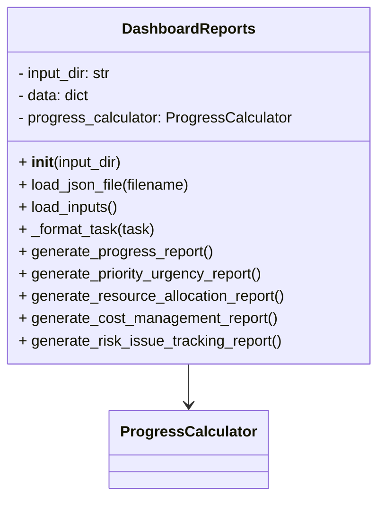
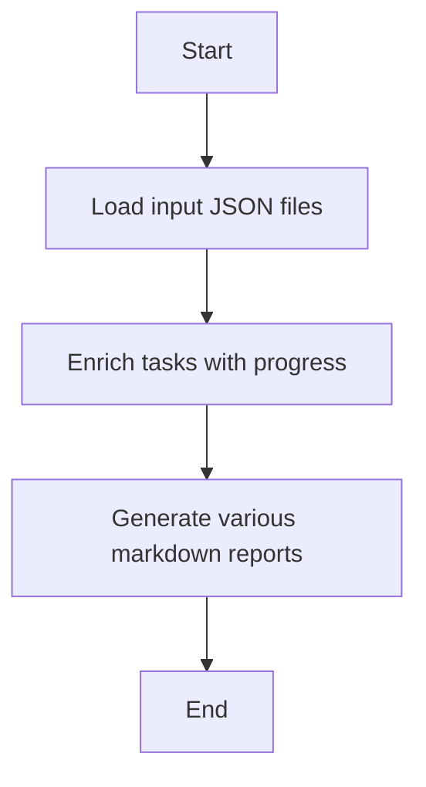

# Dashboards Reports Module

## Overview
The `dashboards_reports` module provides the `DashboardReports` class to generate various project management reports and dashboards. It loads input JSON data, calculates progress, priority, resource allocation, cost management, and risk tracking reports, and formats them as markdown strings.

## Class: DashboardReports

### Description
The `DashboardReports` class loads input data files, enriches tasks with progress information, and generates multiple reports including progress, priority and urgency, resource allocation, cost management, and risk/issue tracking.

### Methods

- `__init__(self, input_dir='SystemInputs/user_inputs')`
  - Initializes with the input directory and creates a `ProgressCalculator` instance.

- `load_json_file(self, filename)`
  - Loads JSON data from a specified file, with special handling for `wbs_scores.json`.

- `load_inputs(self)`
  - Loads all required input JSON files and enriches tasks with progress data.

- `_format_task(self, task)`
  - Formats a task dictionary into a markdown string with status, importance, urgency, score, and progress.

- `generate_progress_report(self)`
  - Generates a markdown progress report dashboard summarizing task statuses and details.

- `generate_priority_urgency_report(self)`
  - Generates a markdown report on task priority and urgency, including an Eisenhower matrix.

- `generate_resource_allocation_report(self)`
  - Generates a markdown resource allocation dashboard summarizing human resources and allocation percentages.

- `generate_cost_management_report(self)`
  - Generates a markdown cost management report summarizing total costs and WBS scores.

- `generate_risk_issue_tracking_report(self)`
  - Generates a markdown risk and issue tracking dashboard listing risks and issues.

## Usage
The class can be used to generate markdown reports for project management dashboards.

## Diagrams

### Mermaid Class Diagram

### Mermaid Report Generation Flowchart

---

## Credits

This module depends on the `ProgressCalculator` class for task progress enrichment and uses Python's built-in `json` module for data handling.

---

This documentation provides a detailed overview of the `dashboards_reports` module to assist developers in understanding and using its functionality effectively.
