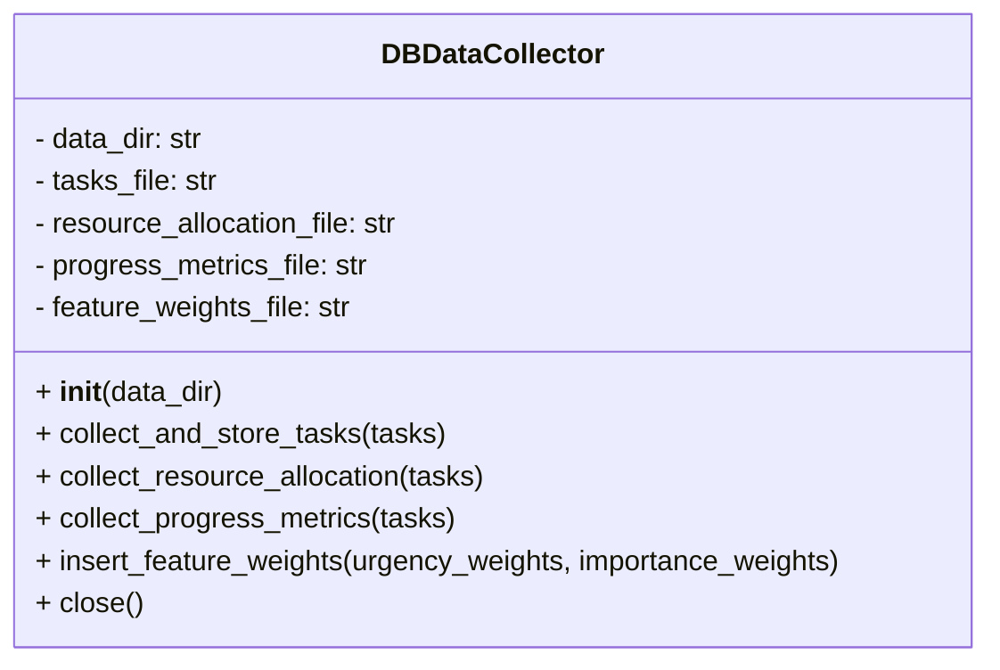
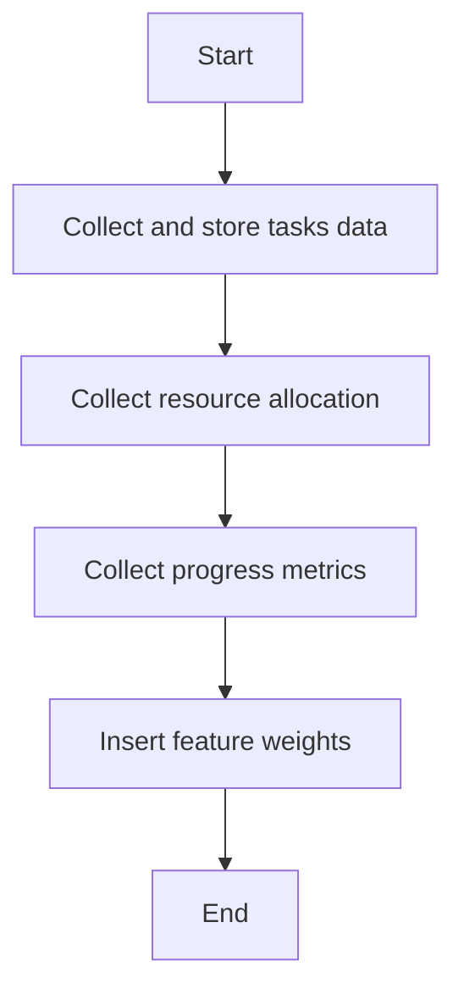

# DB Data Collector Module

## Overview
The `db_data_collector` module provides the `DBDataCollector` class to collect and store various project management data such as tasks, resource allocation, progress metrics, and feature weights into JSON files.

## Class: DBDataCollector

### Description
The `DBDataCollector` class manages data collection and storage for project management inputs and metrics. It writes collected data to JSON files in a specified data directory.

### Methods

- `__init__(self, data_dir='SystemInputs/user_inputs')`
  - Initializes file paths for tasks, resource allocation, progress metrics, and feature weights JSON files.

- `collect_and_store_tasks(self, tasks)`
  - Collects task data including progress and resource allocation, and stores it in a JSON file.

- `collect_resource_allocation(self, tasks)`
  - Analyzes resource allocation from tasks and stores a summary in a JSON file.

- `collect_progress_metrics(self, tasks)`
  - Collects progress percentages for tasks and stores or updates them in a JSON file.

- `insert_feature_weights(self, urgency_weights, importance_weights)`
  - Inserts predefined weights for urgency and importance features into a JSON file.

- `close(self)`
  - Placeholder method for cleanup if needed.

## Usage
The class is used to collect and persist project management data for further processing and analysis.

## Diagrams

### Mermaid Class Diagram

### Mermaid Data Collection Flowchart

---

## Credits

This module uses Python's built-in `json` and `os` modules for file handling and data processing.

---

This documentation provides a detailed overview of the `db_data_collector` module to assist developers in understanding and using its functionality effectively.
