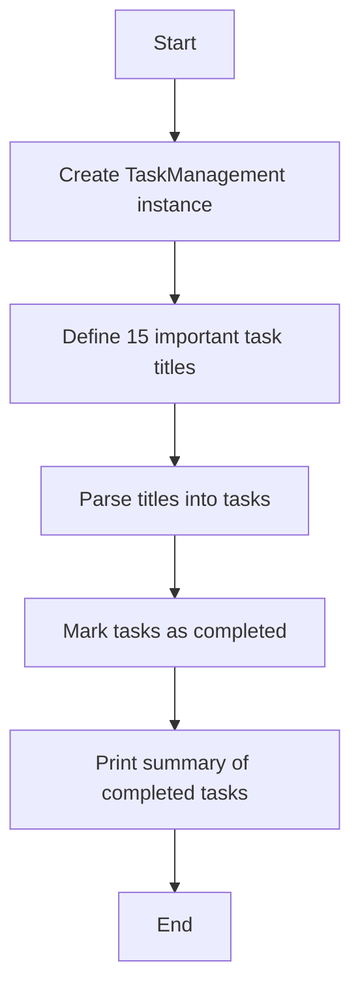
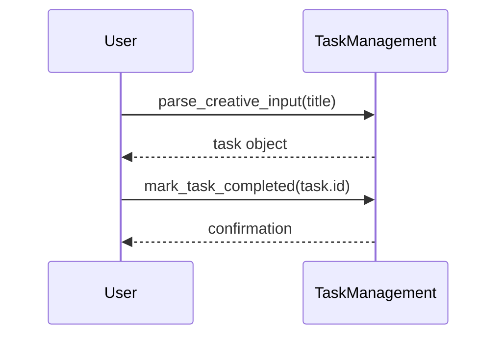

# Do Important Tasks Module

## Overview
The `do_important_tasks` module automates the creation and completion of a set of important tasks within the project management system. It uses the `TaskManagement` class to parse task titles, create tasks, mark them as completed, and print a summary.

## Functions

- `main()`
  - Creates a `TaskManagement` instance.
  - Defines titles for 15 important tasks (including subtasks).
  - Parses each title into a task object.
  - Marks each task as completed.
  - Prints a summary of completed tasks with their IDs, titles, and statuses.

## Usage
The module can be run as a script to simulate completing important tasks:

```python
if __name__ == "__main__":
    main()
```

## Diagrams

### Mermaid Function Flowchart



### Mermaid Task Completion Sequence Diagram



---

## Credits

This module depends on the `TaskManagement` class for task parsing and status management.

---

This documentation provides a detailed overview of the `do_important_tasks` module to assist developers in understanding and using its functionality effectively.
