# Feature Weights Module

## Overview
The `feature_weights` module defines predefined weights for urgency and importance features used in project management task prioritization and evaluation.

## Constants

- `URGENCY_FEATURE_WEIGHTS`
  - A dictionary mapping urgency-related features to their respective weights.
  - Features include deadline proximity, next activity dependency, high delay risk, immediate decision, stakeholder pressure, and others.

- `IMPORTANCE_FEATURE_WEIGHTS`
  - A dictionary mapping importance-related features to their respective weights.
  - Features include dependency, critical path, schedule impact, cost impact, key objectives, risk complexity, and others.

## Usage
These weights are used by other modules to calculate task urgency and importance scores for prioritization and decision-making.

## Diagrams

### Mermaid Feature Weights Diagram

```mermaid
graph TD
    URGENCY_FEATURES[Urgency Features] -->|Weights| DeadlineProximity[Deadline Proximity: 9.5]
    URGENCY_FEATURES --> NextActivity[Next Activity Dependency: 8.0]
    URGENCY_FEATURES --> HighDelayRisk[High Delay Risk: 7.5]
    URGENCY_FEATURES --> ImmediateDecision[Immediate Decision: 8.5]
    URGENCY_FEATURES --> StakeholderPressure[Stakeholder Pressure: 7.0]
    URGENCY_FEATURES --> LimitedResourceTime[Limited Resource Time: 6.5]
    URGENCY_FEATURES --> CompetitiveAdvantage[Competitive Advantage: 6.0]
    URGENCY_FEATURES --> CriticalIssueFix[Critical Issue Fix: 9.0]
    URGENCY_FEATURES --> ExternalScheduleCoordination[External Schedule Coordination: 5.5]
    URGENCY_FEATURES --> HighCompensatoryCost[High Compensatory Cost: 6.5]

    IMPORTANCE_FEATURES[Importance Features] -->|Weights| Dependency[Dependency: 8.0]
    IMPORTANCE_FEATURES --> CriticalPath[Critical Path: 9.0]
    IMPORTANCE_FEATURES --> ScheduleImpact[Schedule Impact: 7.5]
    IMPORTANCE_FEATURES --> CostImpact[Cost Impact: 7.0]
    IMPORTANCE_FEATURES --> KeyObjectives[Key Objectives: 8.5]
    IMPORTANCE_FEATURES --> RiskComplexity[Risk Complexity: 6.5]
    IMPORTANCE_FEATURES --> ResourceRarity[Resource Rarity: 6.0]
    IMPORTANCE_FEATURES --> StakeholderPriority[Stakeholder Priority: 7.0]
    IMPORTANCE_FEATURES --> MilestoneRole[Milestone Role: 7.5]
    IMPORTANCE_FEATURES --> QualityImpact[Quality Impact: 8.0]
    IMPORTANCE_FEATURES --> BottleneckPotential[Bottleneck Potential: 7.0]
    IMPORTANCE_FEATURES --> ReuseFrequency[Reuse Frequency: 5.5]
```

---

## Credits

This module defines static data used across the project management system for task evaluation.

---

This documentation provides a detailed overview of the `feature_weights` module to assist developers in understanding and using its functionality effectively.
