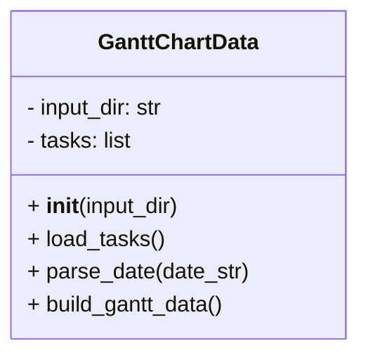
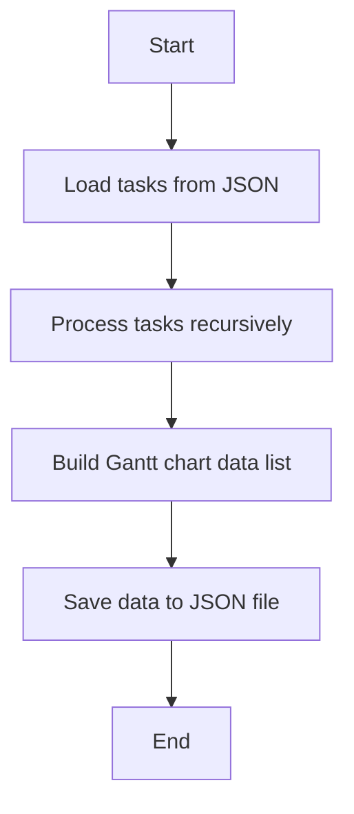

# Gantt Chart Data Module

## Overview
The `gantt_chart_data` module provides the `GanttChartData` class to generate Gantt chart data from project tasks. It loads task data, processes task dates and dependencies, and outputs structured data suitable for Gantt chart visualization.

## Class: GanttChartData

### Description
The `GanttChartData` class loads detailed WBS tasks from JSON, parses dates, calculates task durations and dependencies, and builds a list of task data dictionaries for Gantt chart rendering.

### Methods

- `__init__(self, input_dir='project_inputs/PM_JSON/user_inputs')`
  - Initializes with the input directory and an empty task list.

- `load_tasks(self)`
  - Loads tasks from `detailed_wbs.json` in the input directory.

- `parse_date(self, date_str)`
  - Parses an ISO format date string into a `datetime.date` object.

- `build_gantt_data(self)`
  - Processes tasks recursively to build Gantt chart data including task id, name, start and end dates, dependencies, and progress.

## Usage
The module can be run as a script to generate and save Gantt chart data:

```python
if __name__ == "__main__":
    generator = GanttChartData()
    generator.load_tasks()
    data = generator.build_gantt_data()
    output_path = 'SystemInputs/system_generated/gantt_chart_data.json'
    with open(output_path, 'w', encoding='utf-8') as f:
        json.dump(data, f, indent=2, ensure_ascii=False)
    print(f"Gantt chart data saved to {output_path}")
```

## Diagrams

### Mermaid Class Diagram



### Mermaid Process Flowchart



---

## Credits

This module uses Python's built-in `json`, `os`, and `datetime` modules for data handling and date processing.

---

This documentation provides a detailed overview of the `gantt_chart_data` module to assist developers in understanding and using its functionality effectively.
