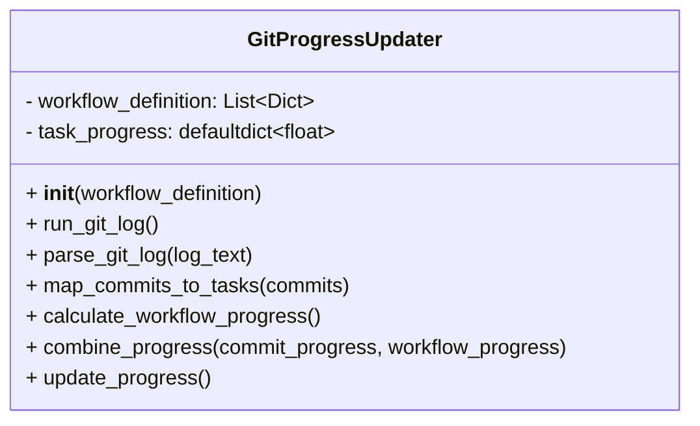
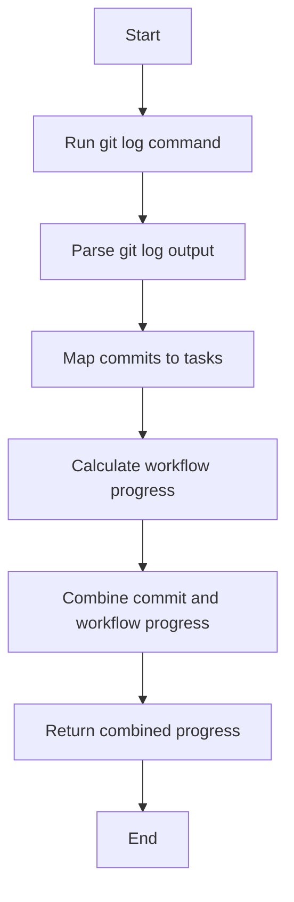

# Git Progress Updater Module

## Overview
The `git_progress_updater` module provides the `GitProgressUpdater` class to analyze git commit logs and update task progress based on commit messages. It maps commits to tasks and combines commit-based progress with workflow progress.

## Class: GitProgressUpdater

### Description
The `GitProgressUpdater` class processes git logs to extract commit information, maps commits to task IDs using regex, calculates progress percentages, and combines this with workflow progress data.

### Methods

- `__init__(self, workflow_definition)`
  - Initializes with a workflow definition list and sets up a task progress dictionary.

- `run_git_log(self)`
  - Runs the git log command to retrieve commit hashes, messages, and changed files.

- `parse_git_log(self, log_text)`
  - Parses the raw git log text into a list of commit dictionaries with hash, message, and files.

- `map_commits_to_tasks(self, commits)`
  - Extracts task IDs from commit messages using regex and calculates normalized progress percentages.

- `calculate_workflow_progress(self)`
  - Placeholder method for workflow step completion tracking.

- `combine_progress(self, commit_progress, workflow_progress)`
  - Combines commit-based and workflow-based progress into a single progress dictionary.

- `update_progress(self)`
  - Orchestrates the process: runs git log, parses commits, maps to tasks, calculates and combines progress, and returns combined progress.

## Usage
The class can be used to update task progress based on git commit history and workflow data.

## Diagrams

### Mermaid Class Diagram

### Mermaid Process Flowchart

---

## Credits

This module uses Python's `subprocess`, `re`, and `collections` modules to interact with git and process commit data.

---

This documentation provides a detailed overview of the `git_progress_updater` module to assist developers in understanding and using its functionality effectively.
