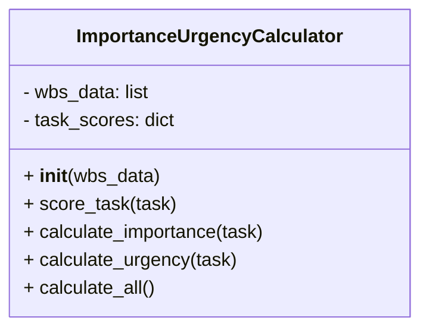
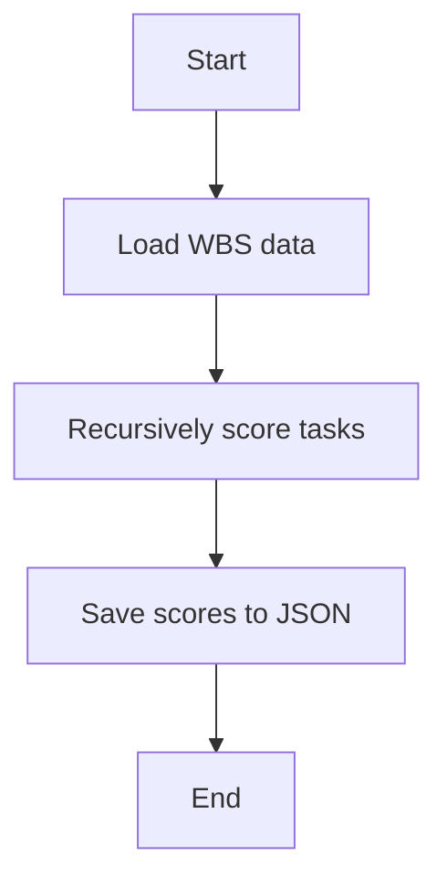

# Importance Urgency Calculator Refactored Module

## Overview
The `importance_urgency_calculator_refactored` module provides the `ImportanceUrgencyCalculator` class to calculate importance and urgency scores for project tasks based on various criteria. It supports hierarchical task structures and scores leaf and parent tasks differently.

## Class: ImportanceUrgencyCalculator

### Description
The `ImportanceUrgencyCalculator` class recursively scores tasks for importance and urgency using weighted factors such as dependencies, critical path involvement, cost impact, stakeholder priority, deadline proximity, risk of delay, and stakeholder pressure.

### Methods

- `__init__(self, wbs_data)`
  - Initializes with a list of task dictionaries representing the work breakdown structure (WBS).

- `score_task(self, task)`
  - Recursively scores a task and its subtasks for importance and urgency.

- `calculate_importance(self, task)`
  - Calculates importance score based on dependency count, critical path, cost impact, and priority.

- `calculate_urgency(self, task)`
  - Calculates urgency score based on deadline proximity, risk of delay, and stakeholder pressure.

- `calculate_all(self)`
  - Calculates scores for all tasks in the WBS.

## Functions

- `load_wbs_from_file(filepath)`
  - Loads WBS data from a JSON file.

- `save_scores_to_json(scores, filepath)`
  - Saves calculated scores to a JSON file.

## Usage
The module can be run as a script to calculate and save importance and urgency scores:

```python
if __name__ == "__main__":
    import os
    wbs_file = os.path.join(os.path.dirname(__file__), '../../SystemInputs/user_inputs/detailed_wbs.json')
    scores_file = os.path.join(os.path.dirname(__file__), '../../SystemInputs/system_generated/wbs_scores.json')
    try:
        wbs_data = load_wbs_from_file(wbs_file)
    except FileNotFoundError:
        print(f"Error: WBS data file not found at {wbs_file}")
        exit(1)
    calculator = ImportanceUrgencyCalculator(wbs_data)
    scores = calculator.calculate_all()
    save_scores_to_json(scores, scores_file)
    print(f"Importance and urgency scores saved to {scores_file}")
```

## Diagrams

### Mermaid Class Diagram



### Mermaid Scoring Process Flowchart



---

## Credits

This module uses Python's built-in `json`, `os`, and `logging` modules for data handling and logging.

---

This documentation provides a detailed overview of the `importance_urgency_calculator_refactored` module to assist developers in understanding and using its functionality effectively.
