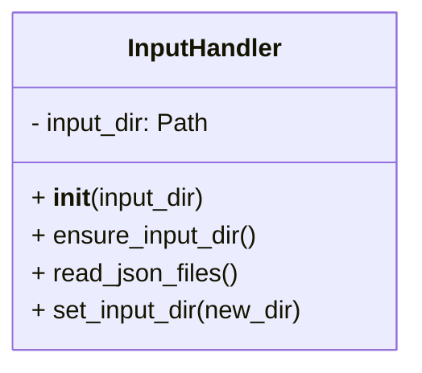
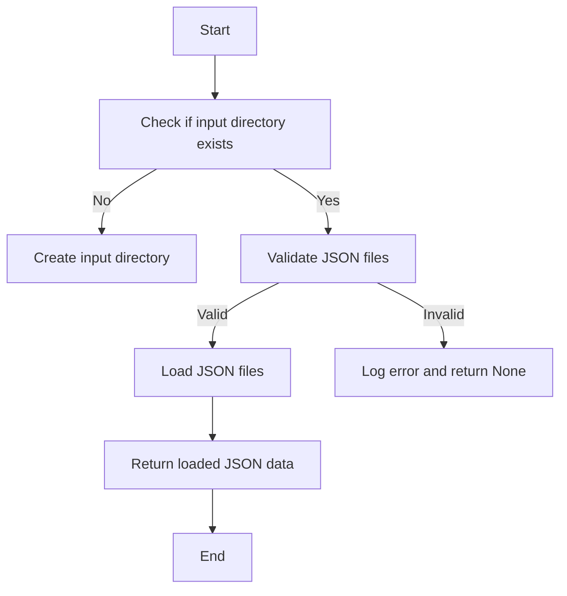

# Input Handler Module

## Overview
The `input_handler` module provides the `InputHandler` class to manage and validate JSON input files for the project management system. It ensures the input directory exists, validates JSON files, and loads their contents.

## Class: InputHandler

### Description
The `InputHandler` class handles input directory management and JSON file reading with validation and error logging.

### Methods

- `__init__(self, input_dir='project_inputs/PM_JSON/user_inputs')`
  - Initializes with the input directory path.

- `ensure_input_dir(self)`
  - Ensures the input directory exists, creating it if necessary.

- `read_json_files(self)`
  - Validates and reads all JSON files in the input directory.
  - Returns a dictionary of filename to JSON content or None if errors occur.

- `set_input_dir(self, new_dir)`
  - Sets a new input directory path.

## Usage
The class is used to manage and validate JSON input files for the system.

## Diagrams

### Mermaid Class Diagram

### Mermaid Process Flowchart

---

## Credits

This module uses Python's built-in `json`, `logging`, and `pathlib` modules for file handling and logging.

---

This documentation provides a detailed overview of the `input_handler` module to assist developers in understanding and using its functionality effectively.
