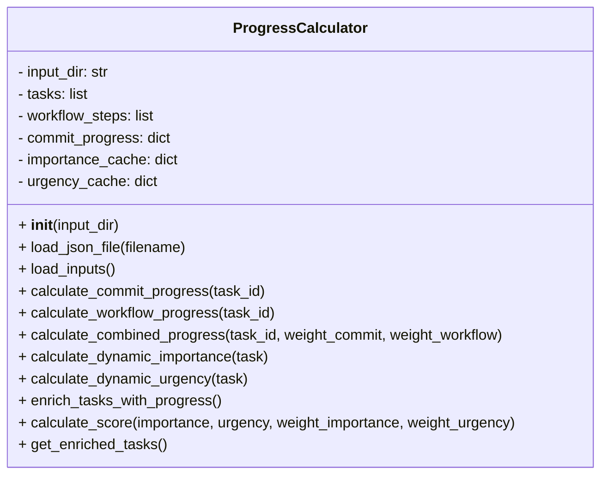
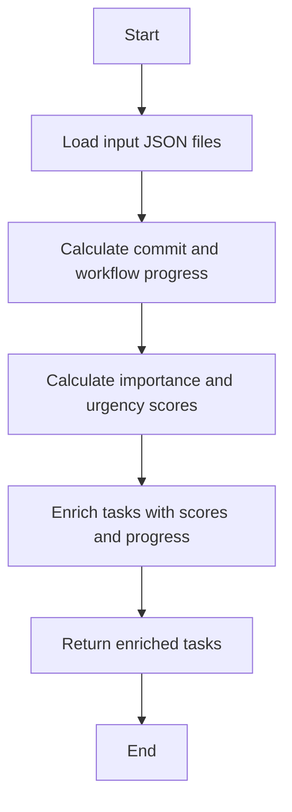

# Progress Calculator Refactored Module

## Overview
The `progress_calculator_refactored` module provides the `ProgressCalculator` class to calculate and enrich project tasks with progress, importance, urgency, and combined scores. It loads input data, calculates commit and workflow progress, and updates task statuses accordingly.

## Class: ProgressCalculator

### Description
The `ProgressCalculator` class loads task and workflow data, calculates commit-based and workflow-based progress, computes dynamic importance and urgency scores, and enriches tasks with these metrics.

### Methods

- `__init__(self, input_dir='project_inputs/PM_JSON/user_inputs')`
  - Initializes with input directory and empty data structures.

- `load_json_file(self, filename)`
  - Loads JSON data from a file in the input directory.

- `load_inputs(self)`
  - Loads detailed WBS tasks, workflow definitions, and commit progress data.

- `calculate_commit_progress(self, task_id)`
  - Returns commit-based progress percentage for a task.

- `calculate_workflow_progress(self, task_id)`
  - Calculates workflow progress as ratio of completed steps to total steps.

- `calculate_combined_progress(self, task_id, weight_commit=0.5, weight_workflow=0.5)`
  - Calculates combined progress weighted by commit and workflow progress, adjusting based on task status.

- `calculate_dynamic_importance(self, task)`
  - Calculates dynamic importance score based on deadline proximity, dependencies, and priority.

- `calculate_dynamic_urgency(self, task)`
  - Calculates dynamic urgency score based on deadline proximity, status, and resource availability.

- `enrich_tasks_with_progress(self)`
  - Enriches tasks with importance, urgency, combined score, and progress, updating task statuses.

- `calculate_score(self, importance, urgency, weight_importance=0.6, weight_urgency=0.4)`
  - Calculates combined score as weighted sum of importance and urgency.

- `get_enriched_tasks(self)`
  - Returns the list of enriched tasks.

## Usage
The class is used to enrich project tasks with progress and priority metrics for reporting and decision-making.

## Diagrams

### Mermaid Class Diagram

### Mermaid Process Flowchart

---

## Credits

This module uses Python's built-in `json`, `os`, `datetime`, and `logging` modules for data handling and logging.

---

This documentation provides a detailed overview of the `progress_calculator_refactored` module to assist developers in understanding and using its functionality effectively.
