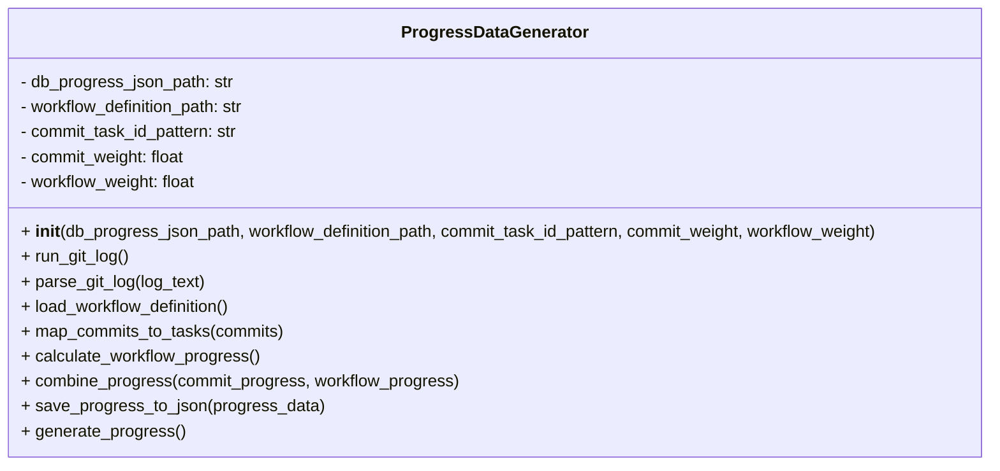
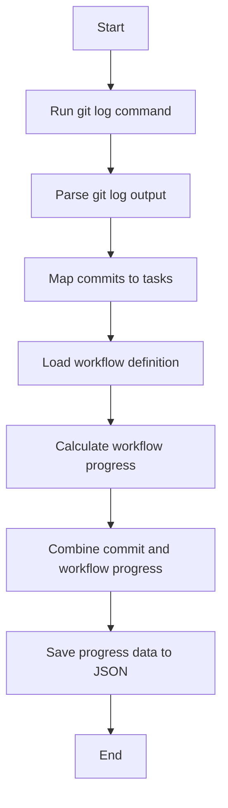

# Progress Data Generator Refactored Module

## Overview
The `progress_data_generator_refactored` module provides the `ProgressDataGenerator` class to generate task progress data by analyzing git commit history and workflow definitions. It combines commit-based and workflow-based progress into a unified progress metric.

## Class: ProgressDataGenerator

### Description
The `ProgressDataGenerator` class runs git log commands, parses commit data, maps commits to tasks using regex patterns, loads workflow definitions, calculates progress, and saves combined progress data to JSON.

### Methods

- `__init__(self, db_progress_json_path, workflow_definition_path, commit_task_id_pattern, commit_weight, workflow_weight)`
  - Initializes paths, regex pattern, and weights for progress calculation.

- `run_git_log(self)`
  - Runs git log command to retrieve commit history.

- `parse_git_log(self, log_text)`
  - Parses git log output into a list of commit dictionaries.

- `load_workflow_definition(self)`
  - Loads workflow definition JSON file.

- `map_commits_to_tasks(self, commits)`
  - Maps commits to task IDs using regex and normalizes progress counts.

- `calculate_workflow_progress(self)`
  - Calculates progress based on workflow steps completion (currently placeholder).

- `combine_progress(self, commit_progress, workflow_progress)`
  - Combines commit and workflow progress using configured weights.

- `save_progress_to_json(self, progress_data)`
  - Saves combined progress data to a JSON file.

- `generate_progress(self)`
  - Orchestrates the process of generating and saving progress data.

## Usage
The module can be run as a script to generate and save task progress data:

```python
if __name__ == "__main__":
    generator = ProgressDataGenerator()
    generator.generate()
```

## Diagrams

### Mermaid Class Diagram



### Mermaid Process Flowchart



---

## Credits

This module uses Python's built-in `subprocess`, `json`, `os`, `re`, and `logging` modules for git interaction, data processing, and logging.

---

This documentation provides a detailed overview of the `progress_data_generator_refactored` module to assist developers in understanding and using its functionality effectively.
