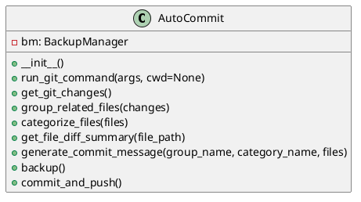

# AutoCommit Module

## Overview

The `auto_commit` module provides the `AutoCommit` class which automates git
operations such as detecting changes, grouping related files, generating commit
messages, backing up user input JSON files, committing changes, and pushing
them to a remote repository. It is designed to streamline the commit process
with detailed commit messages and progress tracking.

## Class: AutoCommit

### Description

The `AutoCommit` class encapsulates methods to interact with git, manage
backups, generate commit messages following conventional commit styles, and
update commit progress databases.

### Methods

- `__init__(self)`
  - Initializes the `AutoCommit` instance and sets up a `BackupManager`.
- `run_git_command(self, args, cwd=None)`
  - Runs a git command with the specified arguments.
  - Parameters:
    - `args` (list): List of git command arguments.
    - `cwd` (str, optional): Directory to run the command in.
  - Returns: Tuple `(success: bool, output: str)`.
- `get_git_changes(self)`
  - Fetches the current git status and returns a list of changes.
  - Returns: List of changed files with status codes.
- `group_related_files(self, changes)`
  - Groups files based on their top-level directory.
  - Parameters:
    - `changes` (list): List of git status lines.
  - Returns: Dictionary mapping top-level directories to lists of file changes.
- `categorize_files(self, files)`
  - Categorizes files into change types such as Added, Modified, Deleted, etc.
  - Parameters:
    - `files` (list): List of tuples `(status, file)`.
  - Returns: Dictionary mapping change categories to lists of files.
- `get_file_diff_summary(self, file_path)`
  - Retrieves a short summary of the staged diff for a file.
  - Parameters:
    - `file_path` (str): Path to the file.
  - Returns: String summary of the diff.
- `generate_commit_message(self, group_name, category_name, files)`
  - Generates a conventional commit style message with emojis.
  - Parameters:
    - `group_name` (str): Group or directory name.
    - `category_name` (str): Change category.
    - `files` (list): List of file paths.
  - Returns: Commit message string.
- `backup(self)`
  - Runs backup of user input JSON files before committing.
- `commit_and_push(self)`
  - Stages, commits, and pushes changes to the remote repository.
  - Updates commit progress and task databases.

## Diagrams

### UML Class Diagram


### Commit Process Flowchart

```plantuml
@startuml
start
:Backup user input JSON files;
:Get git changes;
:Group related files;
:Categorize files;
:For each file category:
  - Generate commit message;
  - Stage file;
  - Commit file;
  - Push commit;
endfor
stop
@enduml
```
- - -
This documentation provides a detailed overview of the `auto_commit` module to
assist developers in understanding and using its functionality effectively.

