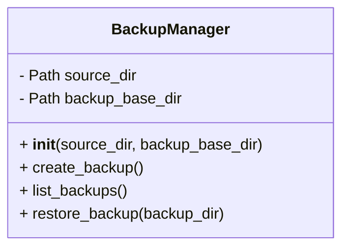
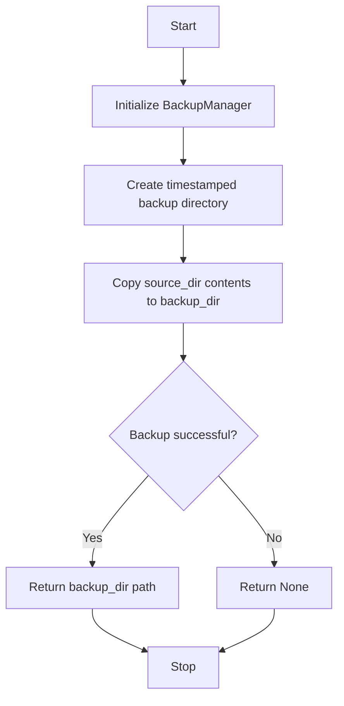

# BackupManager Module

## Overview
The `backup_manager` module provides the `BackupManager` class which manages backups of user input JSON files. It supports creating timestamped backups, listing available backups, and restoring backups to the source directory.

## Class: BackupManager

### Description
The `BackupManager` class encapsulates methods to create backups of user input data, list existing backups, and restore backups when needed.

### Methods

- `__init__(self, source_dir, backup_base_dir)`
  - Initializes the `BackupManager` with source and backup directories.

- `create_backup(self)`
  - Creates a timestamped backup of the source directory.
  - Returns the backup directory path or None on failure.

- `list_backups(self)`
  - Lists available backups sorted by timestamp.

- `restore_backup(self, backup_dir)`
  - Restores the specified backup to the source directory.
  - Returns True on success, False on failure.

## Diagrams

### UML Class Diagram

### Backup Process Flowchart

---

This documentation provides a detailed overview of the `backup_manager` module to assist developers in understanding and using its functionality effectively.
