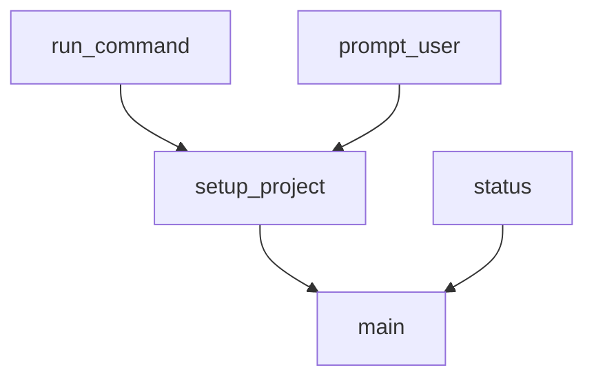
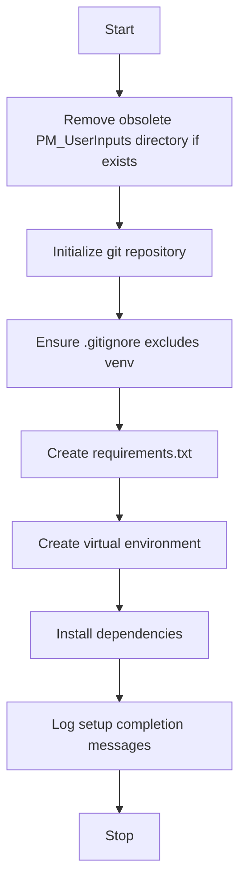

# CLI Commands Module

## Overview
The `cli_commands` module provides command-line interface commands for managing the project setup and status. It includes functions to initialize the project environment, setup virtual environments, install dependencies, and check the current status of the project.

## Functions

- `run_command(command)`
  - Runs a shell command and logs errors if any.

- `prompt_user(question, default=None)`
  - Prompts the user for input with an optional default.

- `setup_project()`
  - Performs project setup including removing obsolete directories, initializing git, creating virtual environment, and installing dependencies.

- `status()`
  - Logs the current status of the project environment.

- `main()`
  - Parses CLI arguments and runs the appropriate command.

## Diagrams

### Mermaid Function Diagram

### Setup Project Flowchart

---

This documentation provides a detailed overview of the `cli_commands` module to assist developers in understanding and using its functionality effectively.
