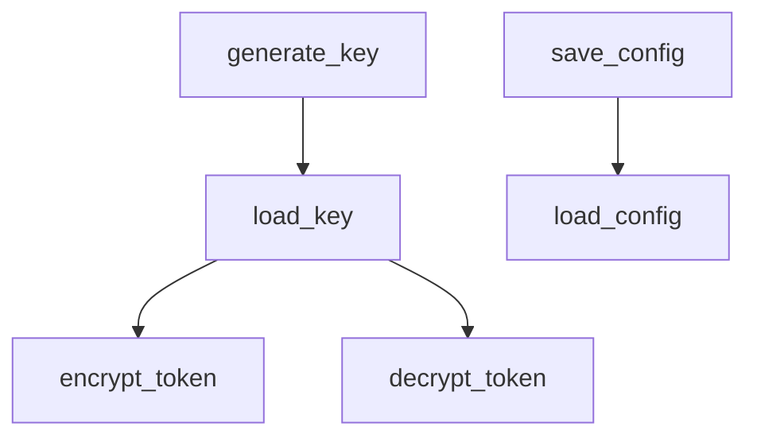
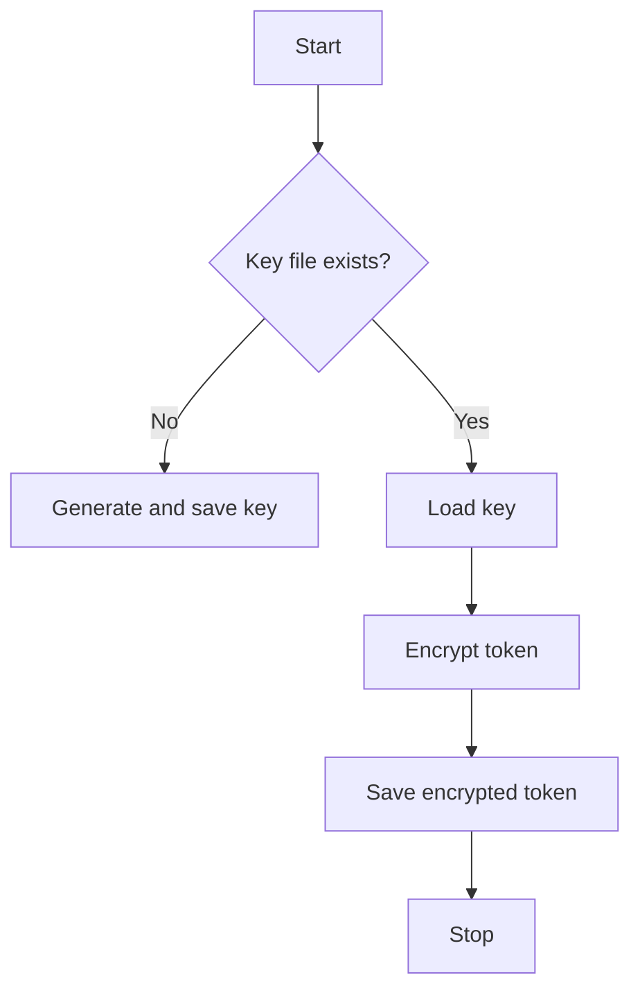

# Config and Token Management Module

## Overview
The `config_and_token_management` module provides functions to securely manage configuration data and encrypted tokens. It supports generating encryption keys, encrypting and decrypting tokens, and saving/loading configuration files.

## Functions

- `generate_key()`
  - Generates a new encryption key and saves it to a file.

- `load_key()`
  - Loads the encryption key from file or generates a new one if missing.

- `encrypt_token(token)`
  - Encrypts a token string and saves it to a file.

- `decrypt_token()`
  - Decrypts and returns the token string from the encrypted file.

- `save_config(config_data)`
  - Saves configuration data as JSON to a config file.

- `load_config()`
  - Loads configuration data from the config file.

## Diagrams

### Mermaid Function Diagram

### Token Encryption Flowchart

---

## Credits

This module uses the `cryptography` library for secure encryption and decryption of tokens.

---

This documentation provides a detailed overview of the `config_and_token_management` module to assist developers in understanding and using its functionality effectively.
