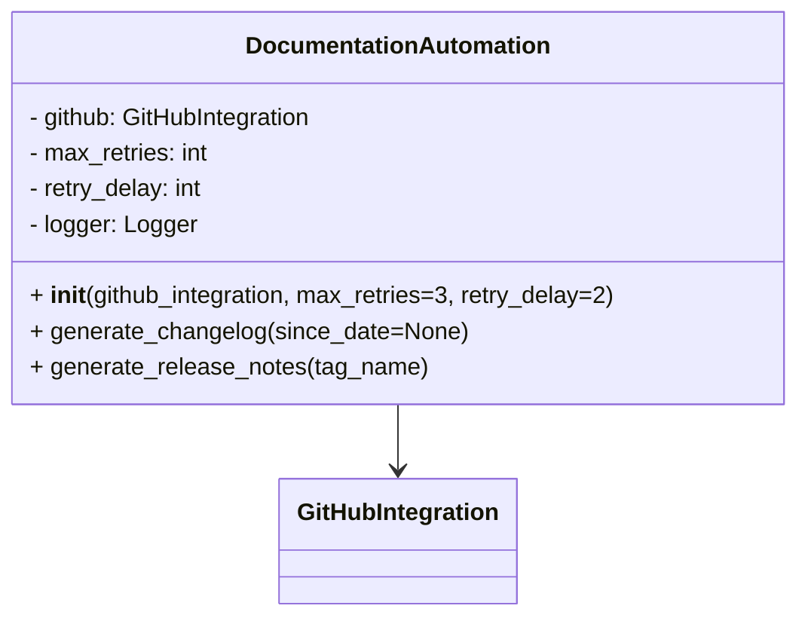
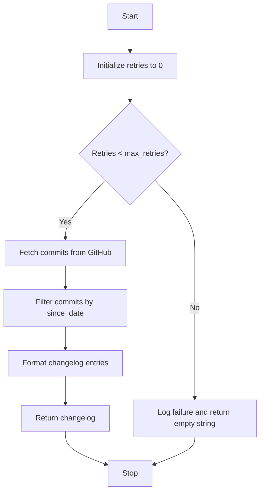

# Documentation Automation Module

## Overview
The `documentation_automation` module automates the generation of changelogs and release notes using GitHub integration. It handles retries and error logging to ensure reliable documentation updates.

## Class: DocumentationAutomation

### Description
The `DocumentationAutomation` class uses a `GitHubIntegration` instance to fetch commit data and generate changelogs and release notes. It supports retrying on failures and logs errors.

### Methods

- `__init__(self, github_integration, max_retries=3, retry_delay=2)`
  - Initializes the automation with GitHub integration and retry settings.

- `generate_changelog(self, since_date=None)`
  - Generates a changelog string of commits since a given date.
  - Retries on failure up to max_retries.

- `generate_release_notes(self, tag_name)`
  - Generates release notes for a given tag name.

## Diagrams

### Mermaid Class Diagram

### Changelog Generation Flowchart

---

## Credits

This module depends on the `GitHubIntegration` module for interacting with GitHub APIs.

---

This documentation provides a detailed overview of the `documentation_automation` module to assist developers in understanding and using its functionality effectively.
