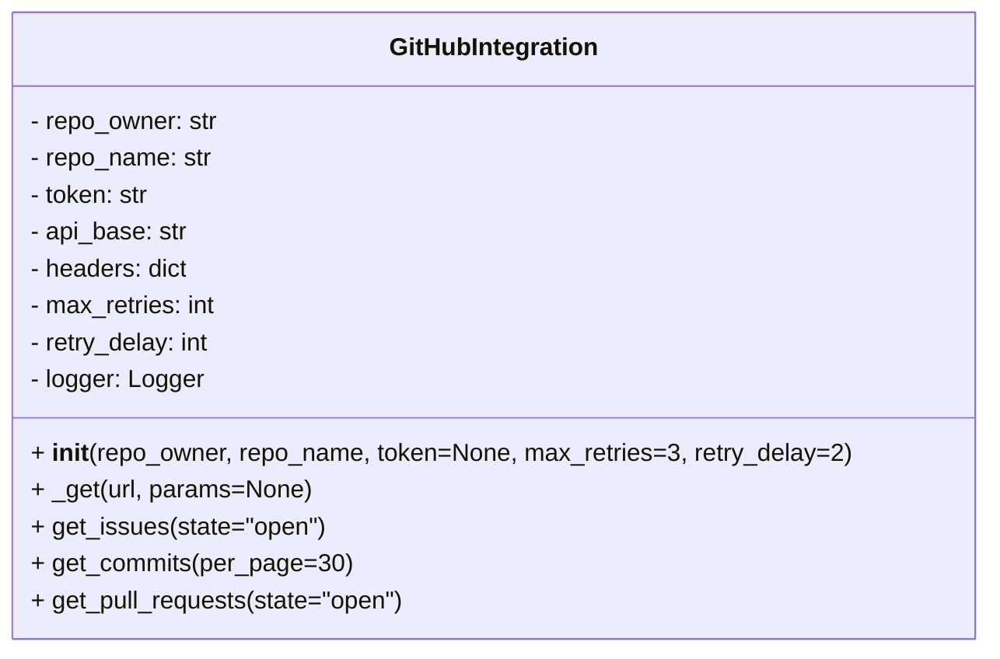
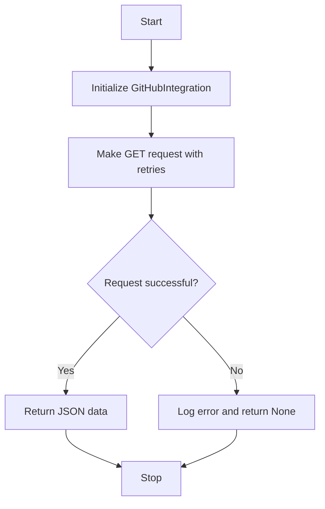

# GitHub Integration Module

## Overview
The `github_integration` module provides the `GitHubIntegration` class to interact with the GitHub API. It supports fetching issues, commits, and pull requests with retry logic and error handling.

## Class: GitHubIntegration

### Description
The `GitHubIntegration` class encapsulates methods to communicate with GitHub's REST API, handling authentication, retries, and logging.

### Methods

- `__init__(self, repo_owner, repo_name, token=None, max_retries=3, retry_delay=2)`
  - Initializes the integration with repository details and optional authentication token.

- `_get(self, url, params=None)`
  - Internal method to perform GET requests with retry logic.

- `get_issues(self, state="open")`
  - Retrieves issues from the repository filtered by state.

- `get_commits(self, per_page=30)`
  - Retrieves recent commits from the repository.

- `get_pull_requests(self, state="open")`
  - Retrieves pull requests filtered by state.

## Diagrams

### Mermaid Class Diagram

### API Request Flowchart

---

## Credits

This module uses the `requests` library for HTTP communication and Python's built-in `logging` for error reporting.

---

This documentation provides a detailed overview of the `github_integration` module to assist developers in understanding and using its functionality effectively.
