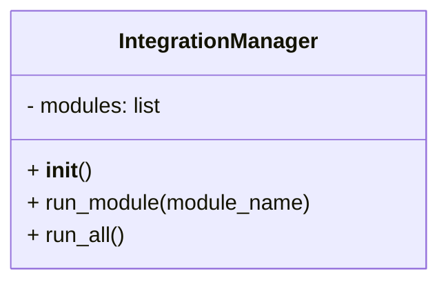
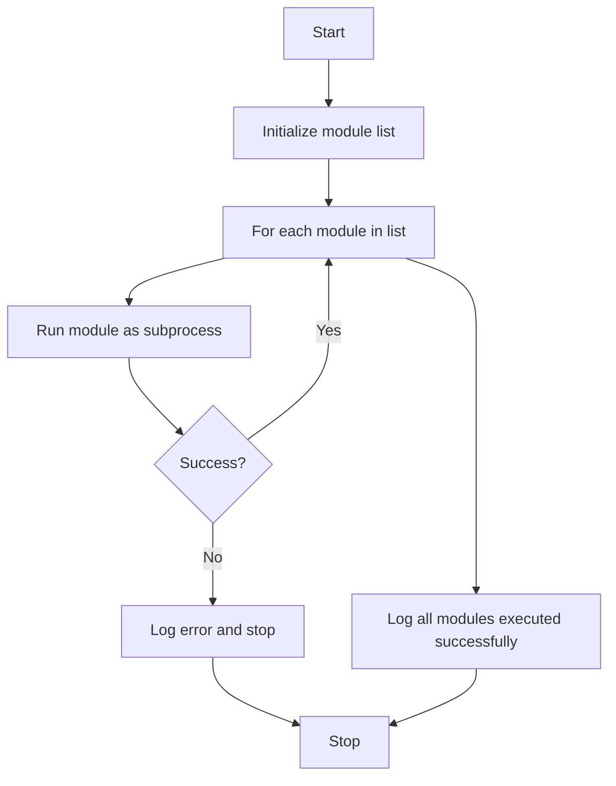

# Integration Manager Module

## Overview
The `integration_manager` module provides the `IntegrationManager` class which manages the execution of multiple project management modules in sequence. It runs each module as a subprocess and logs the output and errors.

## Class: IntegrationManager

### Description
The `IntegrationManager` class maintains a list of module scripts and provides methods to run individual modules or all modules sequentially. It logs execution results and stops on errors.

### Methods

- `__init__(self)`
  - Initializes the manager with a predefined list of module script filenames.

- `run_module(self, module_name)`
  - Runs a specified module script as a subprocess.
  - Logs output and errors.
  - Returns True if successful, False otherwise.

- `run_all(self)`
  - Runs all modules in sequence.
  - Stops execution if any module fails.
  - Logs overall success or failure.

## Diagrams

### Mermaid Class Diagram

### Module Execution Flowchart

---

## Credits

This module uses Python's built-in `subprocess` and `logging` libraries for process management and logging.

---

This documentation provides a detailed overview of the `integration_manager` module to assist developers in understanding and using its functionality effectively.
