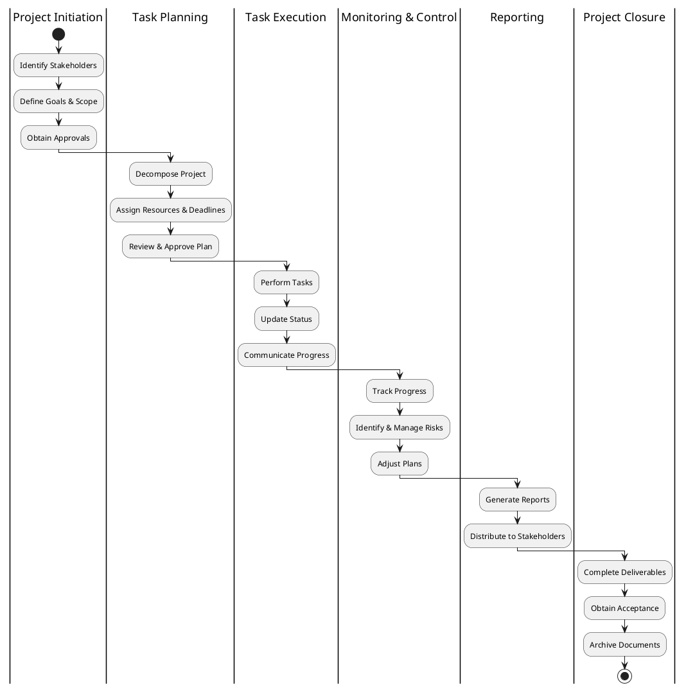
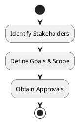
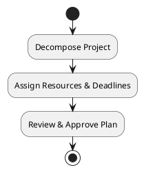
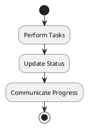
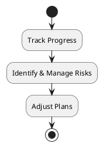
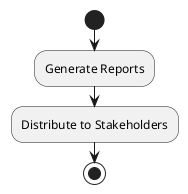
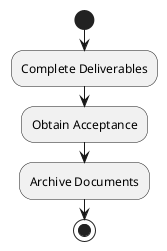

# BPMN Diagrams

## Project Management Workflow

The BPMN diagram below illustrates the main business processes in the Project Management system:

## Detailed BPMN Processes

### Project Initiation

### Task Planning

### Task Execution

### Monitoring and Controlling

### Reporting

### Project Closure

(To be expanded with detailed BPMN diagrams)
