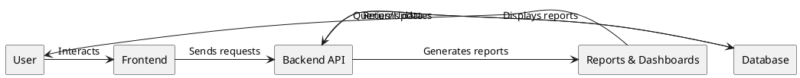
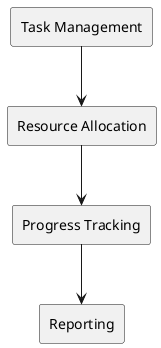
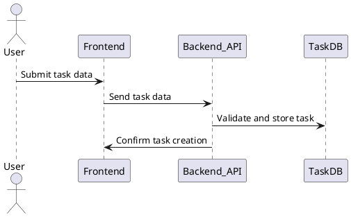
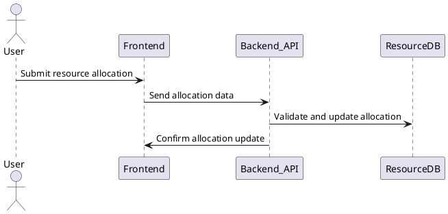
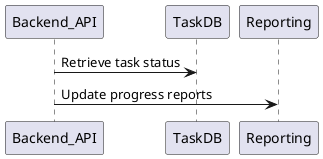
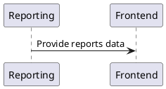

# Data Flow Diagrams (DFD)

## Level 0 DFD

The Level 0 DFD provides a high-level overview of the Project Management system, showing the main processes and data flows:

## Level 1 DFD

The Level 1 DFD breaks down the Backend processes:

(Data stores: Project Database, Task Database, Resource Database)

## Detailed DFDs

### Task Management Process

### Resource Allocation Process

### Progress Tracking Process

### Reporting Process

(To be expanded with detailed diagrams)
