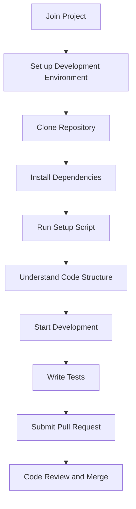

# Developer Onboarding Guide

*Last updated: 2025-07-27*

This guide provides instructions and information for new developers joining the ProjectManagement project. It covers setup, code structure, contribution guidelines, and best practices.



## 1. Prerequisites

- Python 3.7 or higher installed.
- Node.js and npm installed (required for frontend dependencies).
- Git installed for version control.
- Familiarity with GitHub, VS Code, and Python development.

## 2. Project Setup

### 2.1 Clone the Repository

```bash
git clone https://github.com/your-repo/ProjectManagement.git
cd ProjectManagement
```

### 2.2 Install Backend Dependencies

Create and activate a Python virtual environment:

```bash
python3 -m venv venv
source venv/bin/activate  # On Windows: venv\Scripts\activate
```

Install required Python packages:

```bash
pip install -r requirements.txt
```

### 2.3 Install Frontend Dependencies

Navigate to the frontend directory and install dependencies:

```bash
cd frontend
npm install
```

### 2.4 Running the Project

Use the provided setup script to start backend and frontend servers:

```bash
./setup_and_run.sh
```

This will start the backend API server and the React frontend, opening the web interface in your default browser.

## 3. Code Structure Overview

- `backend/`: Python backend API, services, models, and repositories.
- `frontend/`: React frontend application.
- `project_management/`: Core project management modules and CLI tools.
- `Docs/`: Project documentation.
- `build_installer_scripts/`: Scripts for building installers.
- `installer_gui/`: GUI installer code.

## 4. Development Workflow

- Create a new branch for your feature or bugfix with a descriptive name.
- Write clear, maintainable code following project coding standards.
- Write tests for new features or bug fixes.
- Run existing tests to ensure no regressions.
- Commit changes with clear messages.
- Submit a pull request for review.

## 5. Testing

- Backend tests are located in the `tests/` directory.
- Use `pytest` to run tests:

```bash
pytest tests/
```

- Frontend tests can be run using:

```bash
npm test
```

## 6. Contribution Guidelines

- Follow the project's coding style and conventions.
- Document your code and update relevant documentation.
- Engage in code reviews and address feedback promptly.
- Communicate with the team via GitHub Issues and Discussions.

## 7. Resources

- Project documentation in the `Docs/` directory.
- API Reference: `Docs/API_Reference.md`
- Contact the project maintainers via GitHub Issues for questions.

---

Welcome to the ProjectManagement development team! We look forward to your contributions.
