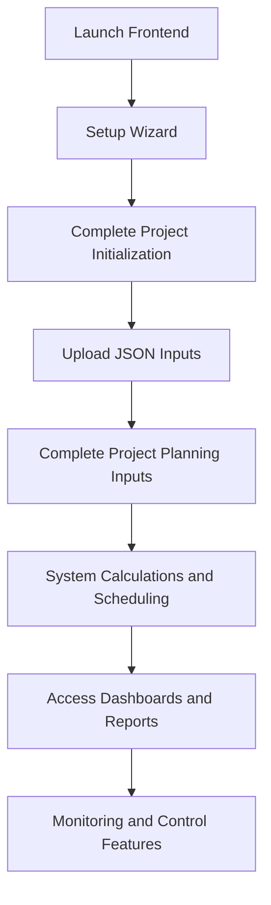

# User Guide for ProjectManagement System

*Last updated: 2025-07-27*

This guide provides instructions for end users on how to use the ProjectManagement system, including frontend and backend features, setup, and workflows.



## 1. Getting Started

### 1.1 System Requirements

- Supported operating systems with Python 3.7+ installed.
- Node.js and npm installed for frontend dependencies.
- Git installed for version control.

### 1.2 Launching the Application

- Run the setup and run script to start the system:

```bash
./setup_and_run.sh
```

- This will start the backend API server and the React frontend.
- The web interface will open automatically at:

```
http://localhost:3000
```

## 2. Setup Wizard

- Upon first launch, the Setup Wizard guides you through initial project setup:
  - Git repository initialization.
  - Creation or update of `.gitignore`.
  - Creation of `requirements.txt`.
  - Python virtual environment creation.
  - Installation of dependencies.
- The wizard provides real-time status updates and error handling.

## 3. JSON File Upload Wizard

- After setup, the JSON File Upload Wizard assists in uploading required JSON input files.
- Upload files one by one, matching expected filenames and locations.
- The system validates filenames and JSON correctness.
- Upload progress and error feedback are provided.
- After all files are uploaded, proceed to project planning.

## 4. Project Planning Inputs

- Define the following inputs via frontend forms:
  - Work Breakdown Structure (WBS) levels.
  - Human resources.
  - Resource allocations.
  - Project start date.
- Inputs are saved through backend APIs and validated against standards.

## 5. Calculations and Scheduling

- The system performs:
  - Resource allocation for lowest-level WBS activities.
  - Duration estimation for each activity.
  - Dependency determination.
  - Addition of start and end milestone activities.
  - Resource leveling.
  - Scheduling with start and end dates.
  - Aggregation of durations, costs, and metrics.

## 6. Monitoring and Control

- The system continuously monitors project progress:
  - Calculates priority, importance, and scores.
  - Manages workflow execution and activity ordering.
  - Creates commits and updates progress percentages.
  - Generates daily reports.
  - Updates dashboards.
  - Checks workflow completion.

## 7. Dashboards and Reporting

- Access dashboards displaying:
  - Progress reports.
  - Priority and urgency visualizations.
  - Cost management summaries.
  - Resource allocation details.
  - Risk management insights.
- Reports are updated dynamically and support filtering and sorting.

## 8. User Interaction Flow Summary

1. Launch frontend → Setup Wizard starts.
2. Complete project initialization.
3. Upload required JSON inputs.
4. Complete project planning inputs.
5. System performs calculations and scheduling.
6. Access dashboards and reports.
7. Use monitoring and control features during project execution.

## 9. Support and Troubleshooting

- Ensure all JSON inputs comply with standards.
- Use the interactive setup wizard for guidance.
- Check logs for errors.
- Contact support via project repository issues.

---
 
This guide helps users effectively interact with the ProjectManagement system through its intuitive frontend and automated backend processes.
