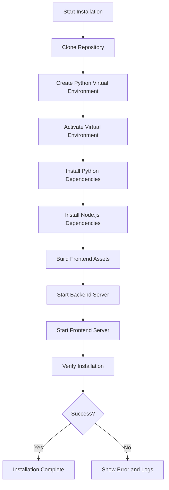
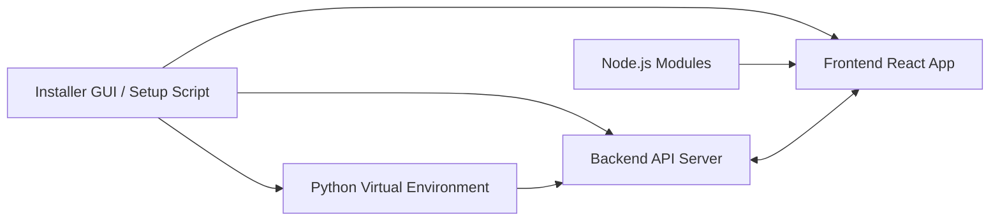

# Installation and Setup Guide

This document provides detailed instructions for installing and setting up the Project Management software on supported platforms.

## Supported Platforms

- Windows
- Linux
- macOS

## Prerequisites

- Python 3.8 or higher
- Node.js 14 or higher
- npm (Node Package Manager)
- Git (optional, for version control)

## Installation Steps

### 1. Clone the Repository

```bash
git clone https://github.com/your-repo/project-management.git
cd project-management
```

### 2. Setup Python Virtual Environment

```bash
python3 -m venv venv
source venv/bin/activate  # On Windows: venv\Scripts\activate
```

### 3. Install Python Dependencies

```bash
pip install -r requirements.txt
```

### 4. Install Node.js Dependencies and Build Frontend

```bash
cd frontend
npm install
npm run build
cd ..
```

### 5. Environment Setup Automation

Run the setup script to automate environment setup:

```bash
./scripts/setup_env.sh
```

This script will:

- Create and activate the Python virtual environment if not already present.
- Install all Python dependencies.
- Install Node.js and npm dependencies in the frontend directory.
- Build frontend assets.

### 6. Starting the Application

- To start the backend API server:

```bash
./backend_start.sh
```

- To start the frontend server:

```bash
./frontend_start.sh
```

- Alternatively, use the unified startup script or installer GUI for one-click launch.

### 7. Verification and Feedback

The setup script and installer GUI provide verification of each step and feedback on success or failure.

Check logs for any errors during installation.

## Troubleshooting

- Ensure Python and Node.js versions meet the prerequisites.
- Check network connectivity for downloading dependencies.
- Review log files in the `logs/` directory for detailed error messages.

## Additional Notes

- For detailed usage instructions, refer to the User Guide.
- For developer setup, see the Developer Onboarding Guide.

---

## Visual Diagrams

### Installation and Setup Flowchart



### System Architecture Overview



---

This installation and setup guide will be updated as the project evolves.
