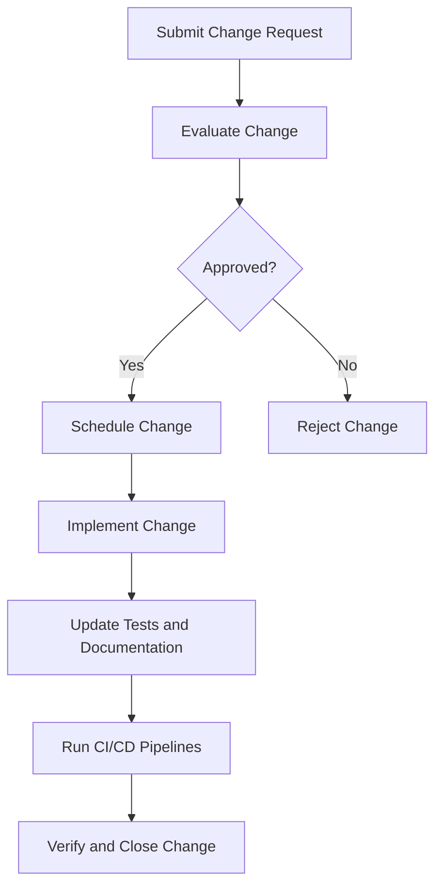
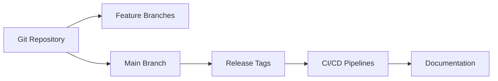

# Change Management and Versioning Plan

*Last updated: 2025-07-27*

## 1. Introduction

### 1.1 Purpose
This document outlines the processes and policies for managing changes and versioning within the ProjectManagement system to ensure controlled and traceable modifications.

### 1.2 Scope
Covers change request handling, version control strategies, release management, and documentation updates.

## 2. Change Management Process

### 2.1 Change Request Submission
- All change requests must be submitted through GitHub Issues or the project management system.
- Requests should include a clear description, rationale, and impact analysis.
- Change requests can be linked to GitHub Issues for traceability.

### 2.2 Change Evaluation
- Changes are evaluated by the project management team for feasibility, impact, and priority.
- Risk assessment and resource availability are considered.
- Automated tools assist in impact analysis and regression testing.

### 2.3 Approval and Scheduling
- Approved changes are scheduled into the project timeline.
- Stakeholders are notified of planned changes and expected timelines.
- Change schedules are tracked in GitHub Projects and dashboards.

### 2.4 Implementation
- Changes are implemented following coding standards and best practices.
- Automated tests are updated or created to cover changes.
- Continuous integration pipelines validate changes before merging.

### 2.5 Verification and Closure
- Changes undergo testing and review.
- Upon successful verification, change requests are closed and documentation updated.
- Release notes and changelogs are generated automatically.

## 3. Version Control Strategy

### 3.1 Repository Management
- The project uses Git for version control.
- Branching strategy follows GitFlow or a similar model.
- Feature branches are used for development; main branch is protected.

### 3.2 Version Numbering
- Semantic Versioning (SemVer) is used: MAJOR.MINOR.PATCH.
- Major releases introduce incompatible API changes.
- Minor releases add functionality in a backward-compatible manner.
- Patch releases include backward-compatible bug fixes.

### 3.3 Release Management
- Releases are tagged in the Git repository.
- Release notes and changelogs are generated automatically.
- Automated deployment pipelines are triggered on release tags.

### 3.4 Documentation Versioning
- Documentation is versioned alongside code.
- Changes to documentation are reviewed and approved as part of the change process.
- Documentation updates are included in release notes.

## 4. Tools and Automation

- Use of GitHub Actions for automated testing, building, and deployment.
- Automated generation of changelogs and release notes.
- Integration with project management tools for tracking change requests.
- Use of bots to automate issue and pull request management.

## 5. Roles and Responsibilities

- Project Manager: Oversees change management process.
- Developers: Implement and test changes.
- QA Team: Verify changes and report issues.
- Documentation Team: Update documentation accordingly.
- Automation Engineers: Maintain CI/CD pipelines and bots.

## 6. Communication

- Regular updates on change status via project dashboards and notifications.
- Stakeholder meetings to discuss major changes and releases.
- Use of GitHub Discussions and chat channels for collaboration.

## 7. Revision History

| Version | Date       | Description               | Author       |
|---------|------------|---------------------------|--------------|
| 1.2     | 2025-07-27 | Updated to reflect current implementation | Project Team |

## Visual Diagrams

### Change Management Process Flowchart

### Version Control Strategy Overview

---
