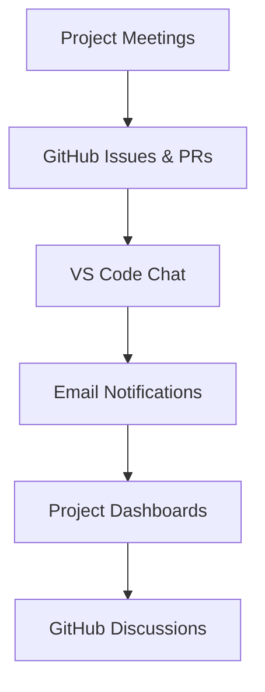
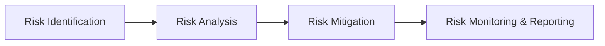
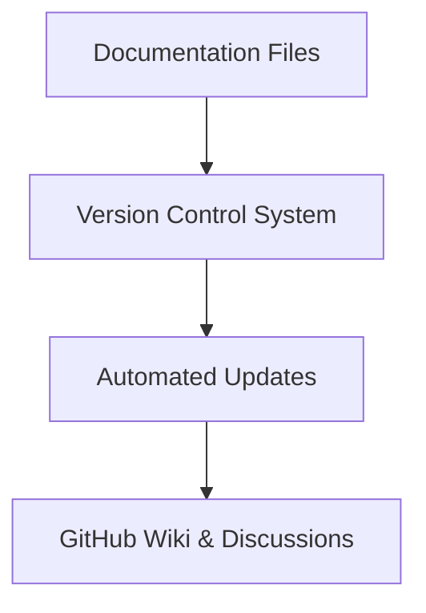

# Communication, Risk Management, and Documentation Plan

*Last updated: 2025-07-27*

## 1. Communication Plan

### 1.1 Purpose
To establish effective communication channels and protocols among project stakeholders to ensure timely and accurate information flow.

### 1.2 Communication Methods
- Regular project meetings (weekly status updates, sprint planning, retrospectives).
- GitHub Issues and Pull Requests for task discussions and reviews.
- VS Code chat interface for informal and real-time communication.
- Email notifications for critical alerts and milestones.
- Project dashboards and reports accessible via VS Code and GitHub.
- Use of GitHub Discussions and chat channels for collaboration.

### 1.3 Roles and Responsibilities
- Project Manager: Facilitates communication and coordinates meetings.
- Team Members: Provide updates and participate actively.
- Stakeholders: Review progress and provide feedback.
- Documentation Team: Maintain communication documentation and updates.

### 1.4 Communication Schedule
- Daily stand-ups or asynchronous updates.
- Weekly progress reports.
- Milestone reviews and retrospectives.

## 2. Risk Management Plan

### 2.1 Risk Identification
- Identify potential risks related to technology, resources, schedule, and external dependencies.

### 2.2 Risk Analysis
- Assess likelihood and impact of identified risks.
- Prioritize risks based on severity.
- Use automated tools for risk detection and monitoring.

### 2.3 Risk Mitigation Strategies
- Develop contingency plans.
- Allocate resources for risk management.
- Monitor risks continuously.
- Integrate risk management into project dashboards.

### 2.4 Risk Monitoring and Reporting
- Regularly review risk status in project meetings.
- Update risk register and communicate changes.
- Use GitHub Issues to track and manage risks.

## 3. Documentation Plan

### 3.1 Documentation Objectives
- Ensure all project documentation is accurate, up-to-date, and accessible.
- Support project transparency and knowledge sharing.
- Automate documentation updates where possible.

### 3.2 Documentation Types
- Requirements and design documents.
- Implementation and testing plans.
- User manuals and help guides.
- Change logs and decision records.
- Automated changelogs and release notes.

### 3.3 Documentation Management
- Store documentation in markdown or text files within the project repository.
- Use version control to track changes.
- Automate documentation updates and synchronization where possible.
- Integrate with GitHub Wiki for extended collaboration.

### 3.4 Roles and Responsibilities
- Documentation Team: Create and maintain documents.
- Project Manager: Review and approve documentation.
- Developers and QA: Contribute to relevant documentation.

## 4. Revision History

| Version | Date       | Description               | Author       |
|---------|------------|---------------------------|--------------|
| 1.2     | 2025-07-27 | Updated to reflect current implementation | Project Team |

## Visual Diagrams

### Communication Plan Overview

### Risk Management Process

### Documentation Management Workflow

---
