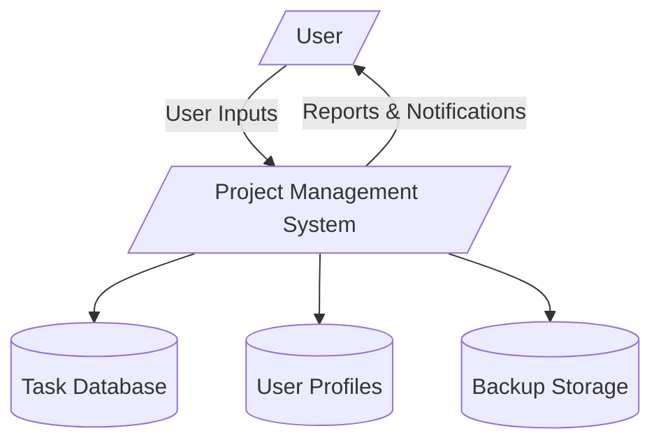
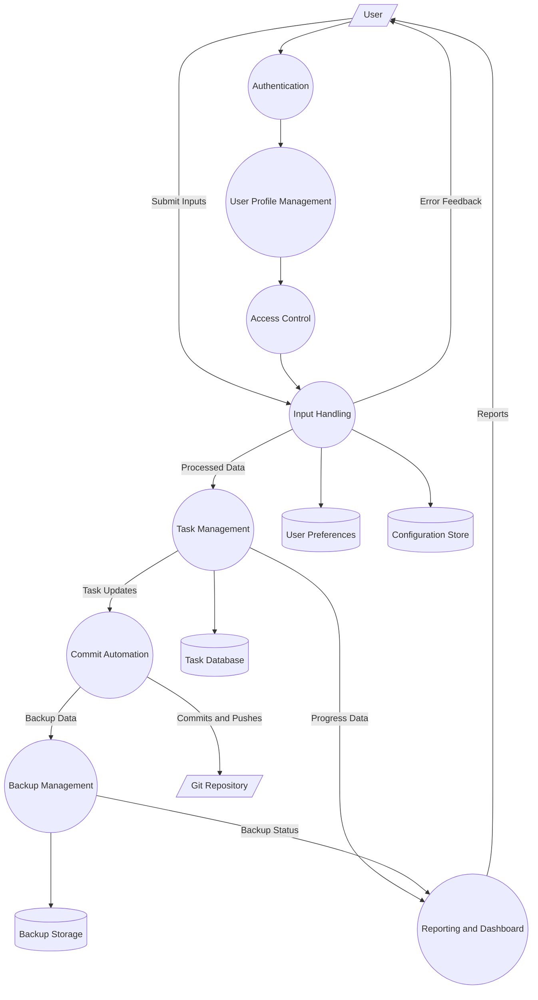
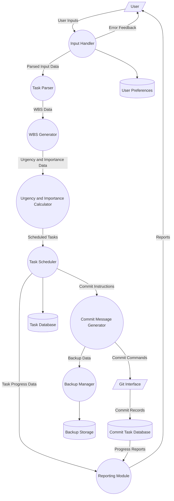
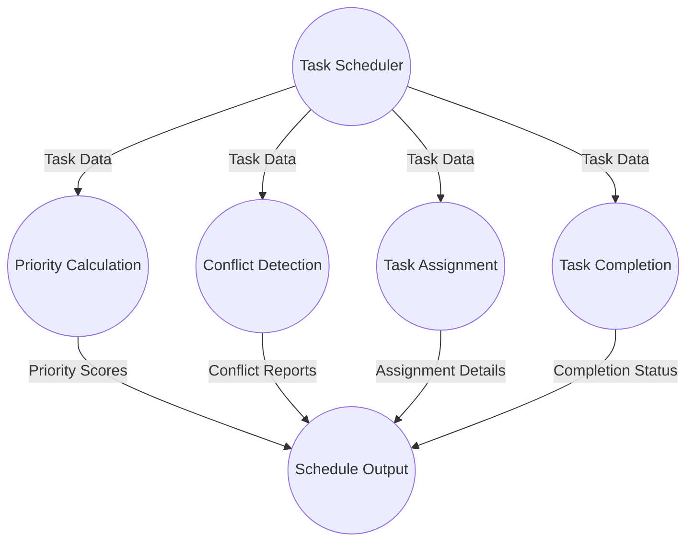
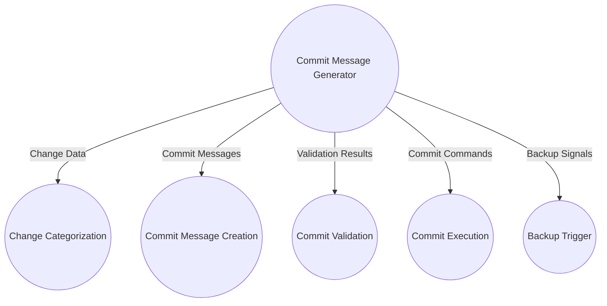
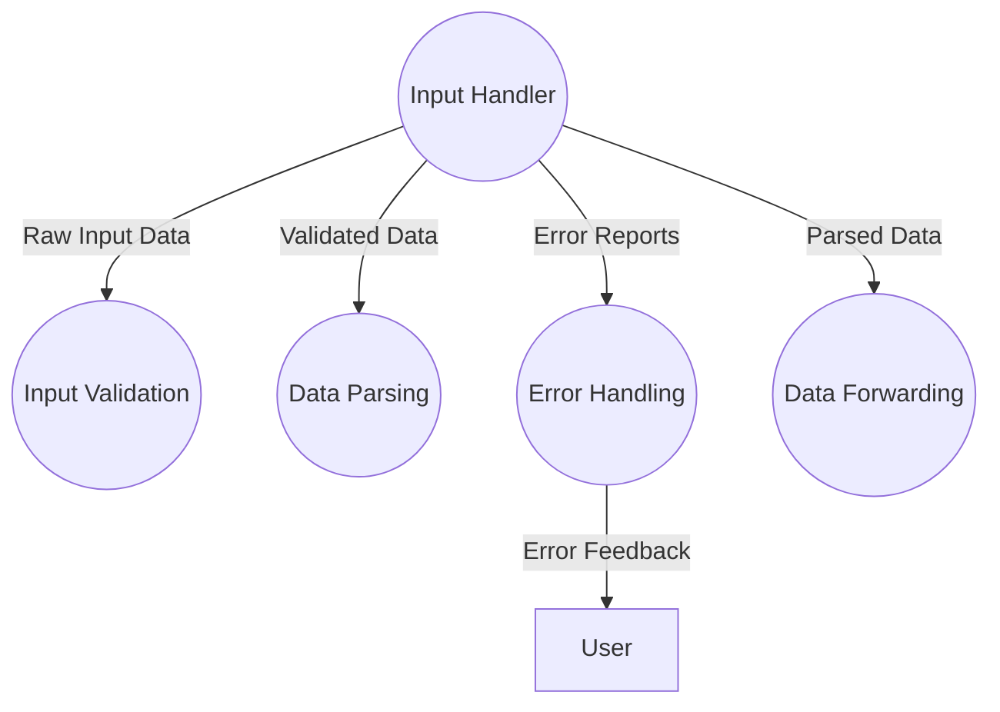
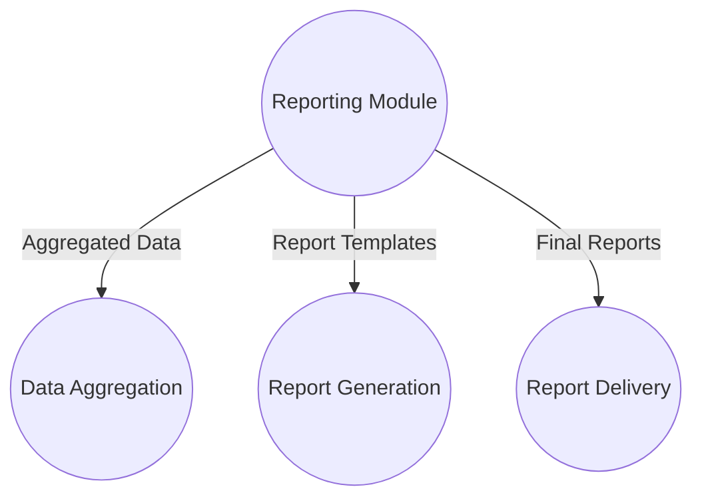

# Data Flow Diagrams (DFD) for Project Management Software

This document contains Data Flow Diagrams (DFD) at levels 0, 1, 2, and 3 for the project management software, updated with standard DFD symbols and additional data stores, processes, and data flows as per feedback.

---

## Legend

- **Process:** Rounded rectangle
- **Data Store:** Open-ended rectangle
- **External Entity:** Simple rectangle
- **Data Flow:** Arrow with label

---

## Level 0 DFD - Context Diagram

---

## Level 1 DFD - High-Level Processes

---

## Level 2 DFD - Detailed Task Management and Commit Automation

---

## Level 3 DFD - Task Scheduler Detailed Processes

---

## Level 3 DFD - Commit Message Generator Detailed Processes

---

## Level 3 DFD - Input Handler Detailed Processes

---

## Level 3 DFD - Reporting Module Detailed Processes

---

*Note:* The diagrams represent the main data flows and processes based on the current understanding of the software architecture and modules. Data stores are represented as open rectangles, processes as rounded rectangles, and external entities as simple rectangles.
