# Data Flow Diagrams (DFD) for Project Management Software

This document contains Data Flow Diagrams (DFD) at levels 0, 1, 2, and 3 for the project management software.

---

## Current State DFD Diagrams

These diagrams represent the current state of the system, showing the existing data flows, processes, and data stores.

### Legend

- **Process:** Rounded rectangle
- **Data Store:** Open-ended rectangle
- **External Entity:** Simple rectangle
- **Data Flow:** Arrow with label

---

## Level 0 DFD - Context Diagram

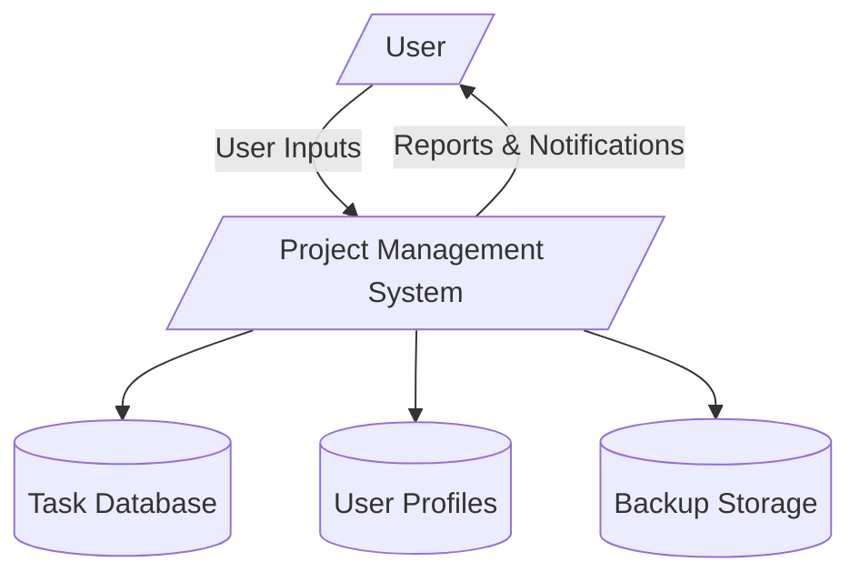

---

## Level 1 DFD - High-Level Processes

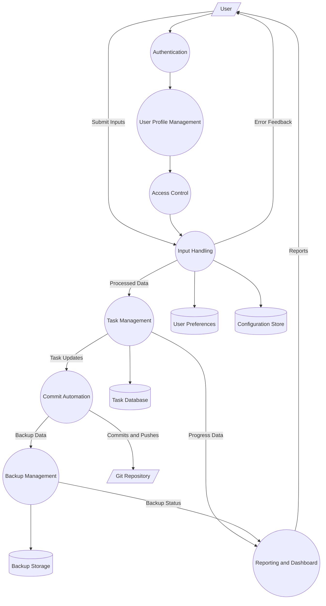

---

## Level 2 DFD - Detailed Task Management and Commit Automation

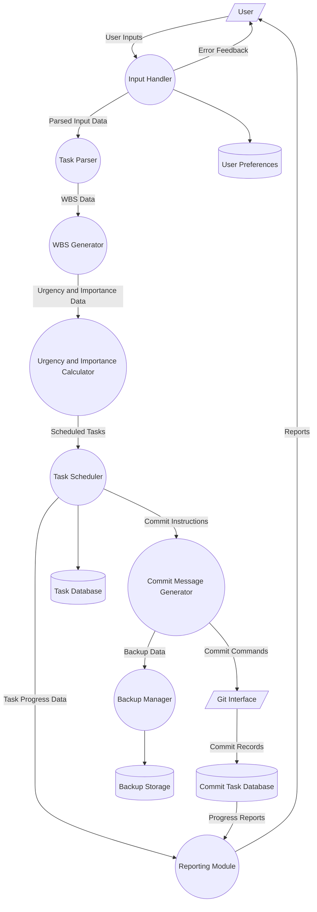

---

## Level 3 DFD - Task Scheduler Detailed Processes

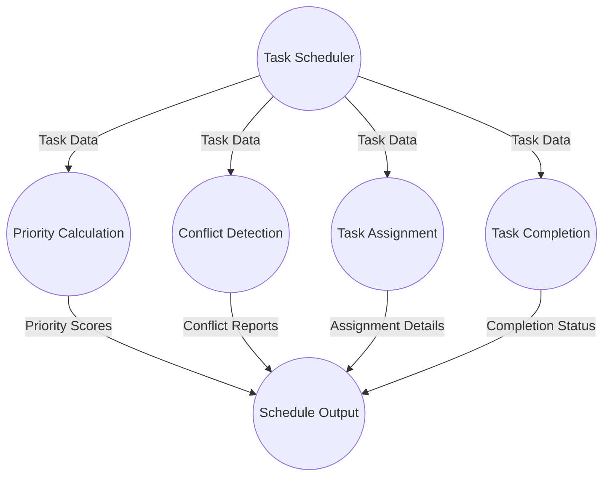

---

## Level 3 DFD - Commit Message Generator Detailed Processes

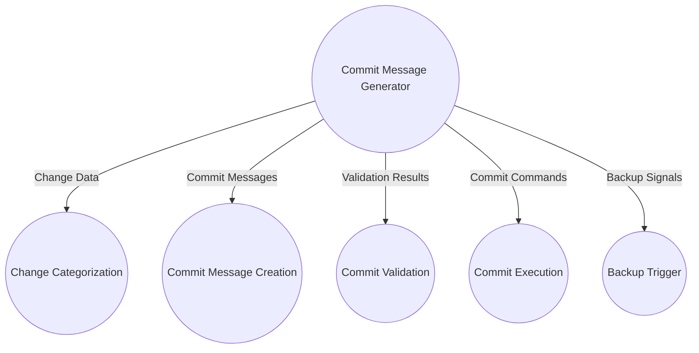

---

## Level 3 DFD - Input Handler Detailed Processes

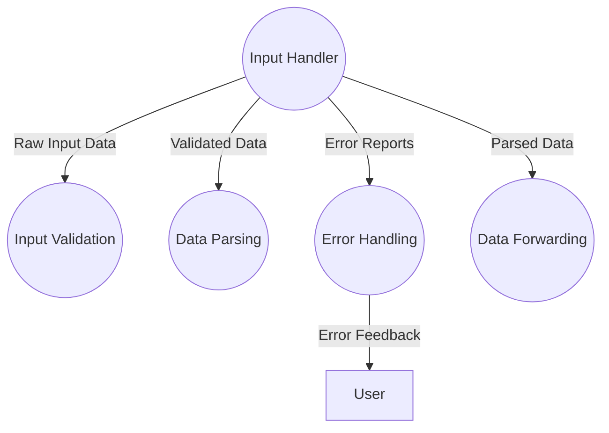

---

## Level 3 DFD - Reporting Module Detailed Processes

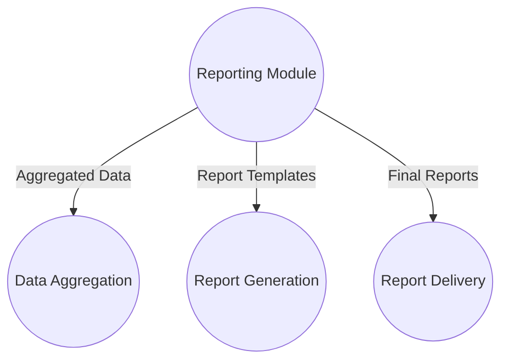

---

*Note:* The diagrams represent the main data flows and processes based on the current understanding of the software architecture and modules. Data stores are represented as open rectangles, processes as rounded rectangles, and external entities as simple rectangles.

---

## Optimized State DFD Diagrams

These diagrams represent the optimized and improved data flows and processes for the system, incorporating best practices for clarity, modularity, and maintainability.

### Legend

- **Process:** Rounded rectangle
- **Data Store:** Open-ended rectangle
- **External Entity:** Simple rectangle
- **Data Flow:** Arrow with label

---

### Level 0 DFD - Context Diagram (Optimized)

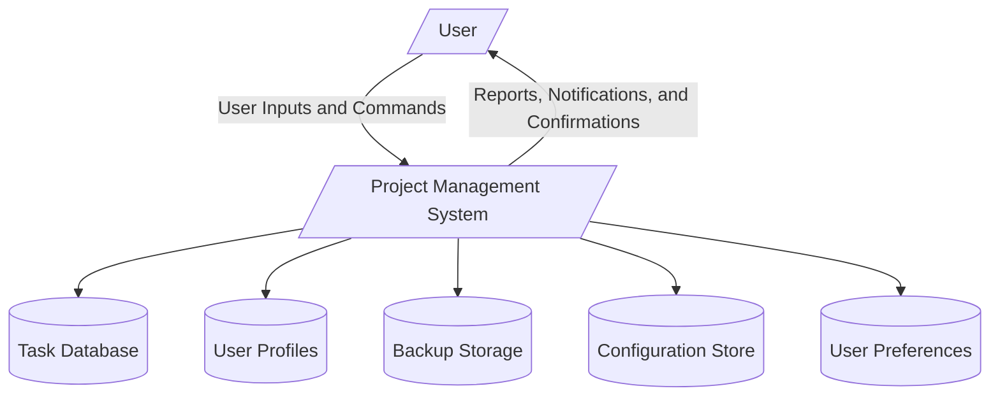

---

### Level 1 DFD - High-Level Processes (Optimized)

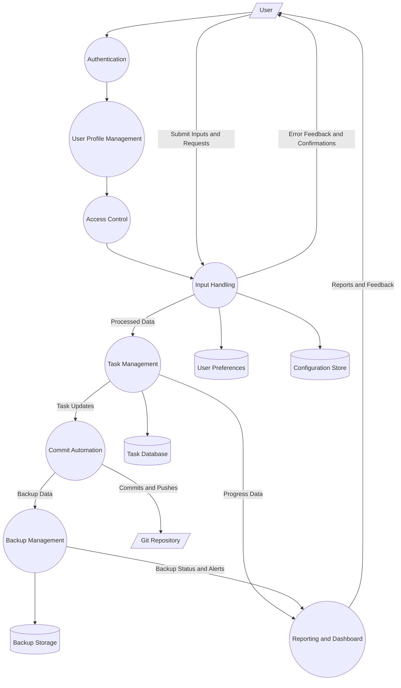

---

### Level 2 DFD - Detailed Task Management and Commit Automation (Optimized)

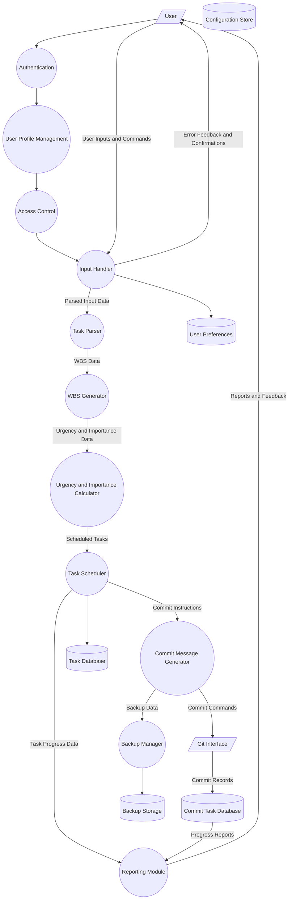

---

### Level 3 DFD - Task Scheduler Detailed Processes (Optimized)

---

### Level 3 DFD - Commit Message Generator Detailed Processes (Optimized)

---

### Level 3 DFD - Input Handler Detailed Processes (Optimized)

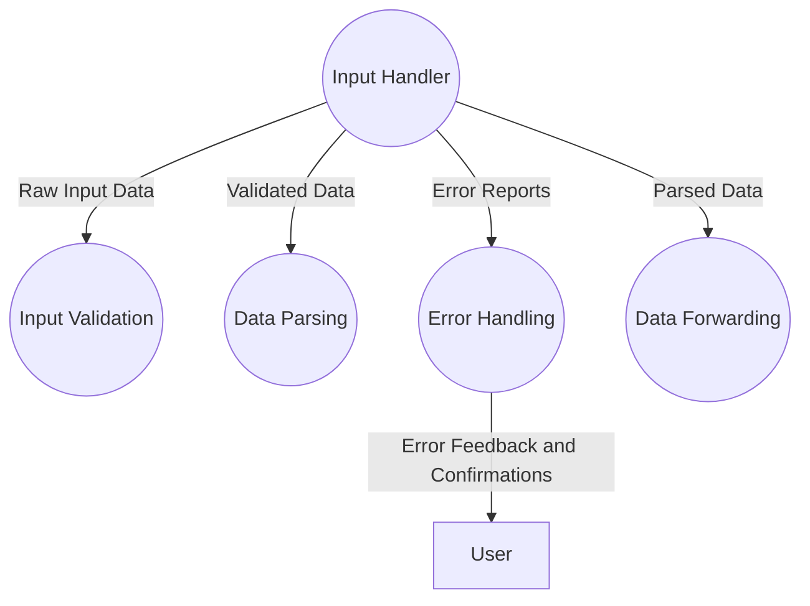

---

### Level 3 DFD - Reporting Module Detailed Processes (Optimized)

---

*Note:* The Optimized State diagrams incorporate improvements such as consolidated data flows, grouped related processes and data stores, clear separation of user management, added missing data stores, explicit error feedback and confirmation flows, minimized granularity, consistent naming conventions, and layering to avoid overcrowding.

---

## Transition from Current State to Optimized State

To move from the Current State to the Optimized State in your Data Flow Diagrams, consider the following steps:

1. **Consolidate Redundant Data Flows:** Identify and merge data flows that carry similar or overlapping information to reduce diagram complexity.

2. **Group Related Processes and Data Stores:** Organize related components together to highlight modularity and reduce cross-diagram clutter.

3. **Separate User Management Processes:** Clearly distinguish authentication, profile management, and access control processes for improved clarity.

4. **Add Missing Data Stores:** Incorporate essential data stores such as configuration storage, user preferences, and backup storage where applicable.

5. **Standardize Symbols and Naming:** Use consistent DFD symbols and naming conventions across all diagrams to enhance readability.

6. **Include Error Feedback and Confirmation Flows:** Explicitly represent system-user interactions like error messages and confirmations.

7. **Minimize Unnecessary Granularity:** Focus on meaningful data exchanges by avoiding overly detailed flows that do not add value.

8. **Ensure Complete Data Interactions:** Verify that all critical data interactions, especially for backup and reporting, are captured.

9. **Layer Diagrams:** Use layering techniques to progressively reveal complexity, preventing overcrowding in any single diagram.

Implementing these steps will improve the clarity, maintainability, and accuracy of your DFD diagrams, facilitating better understanding and communication among stakeholders.

---

## Recommendations for Optimizing System Data Flows

To optimize the data flows within the project management system, consider the following recommendations:

1. **Eliminate Redundant Data Flows:** Review the system to identify and remove or consolidate data flows that carry duplicate or overlapping information, reducing complexity and improving performance.

2. **Modularize Processes and Data Stores:** Group related processes and data stores into cohesive modules to enhance maintainability and scalability.

3. **Clarify User Management Flows:** Separate authentication, profile management, and access control flows distinctly to improve security and clarity.

4. **Incorporate Essential Data Stores:** Ensure all necessary data stores such as configuration settings, user preferences, and backup storage are included and properly integrated.

5. **Standardize Naming and Symbols:** Use consistent naming conventions and standard DFD symbols throughout the system to facilitate understanding and reduce errors.

6. **Explicitly Handle Errors and Confirmations:** Design data flows to include error feedback and confirmation messages, ensuring robust user-system interactions.

7. **Reduce Unnecessary Granularity:** Focus on meaningful data exchanges by avoiding overly detailed or trivial data flows that do not add value.

8. **Capture All Critical Interactions:** Verify that all essential data interactions, especially those related to backup, reporting, and system monitoring, are accurately represented.

9. **Adopt Layered Diagramming:** Use layered diagrams to progressively reveal system complexity, preventing overcrowding and aiding comprehension.

Implementing these recommendations will help optimize the system's data flows, leading to improved clarity, efficiency, and maintainability.
    BackupManager -->|Backup Status and Alerts| Reporting
