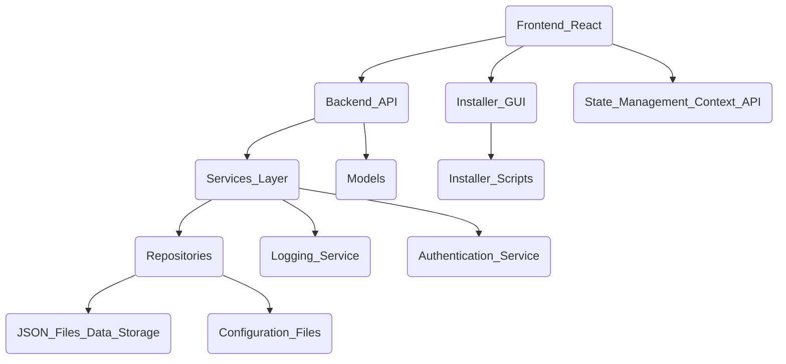
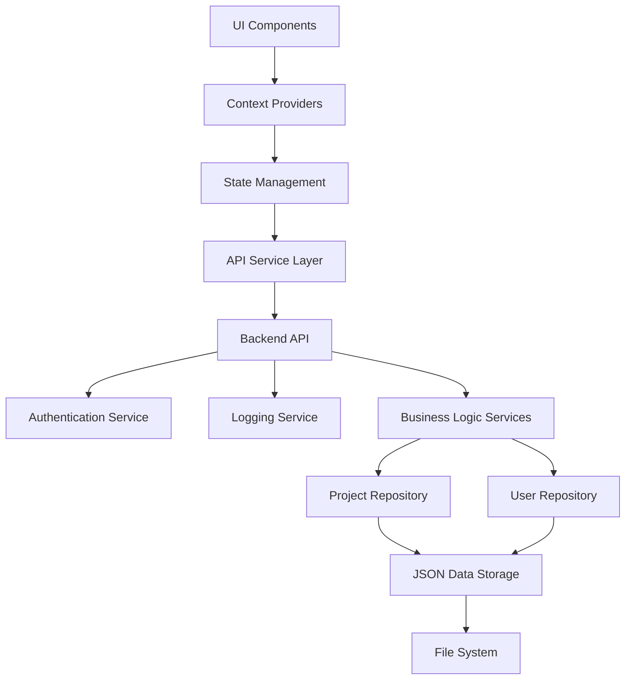
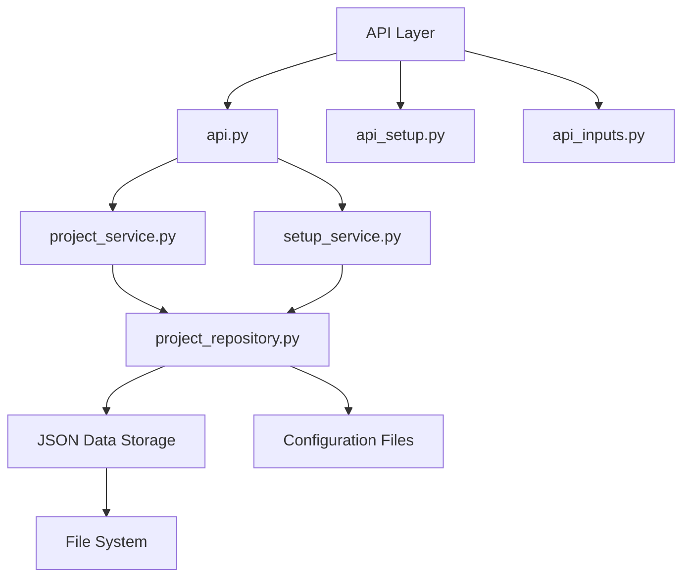
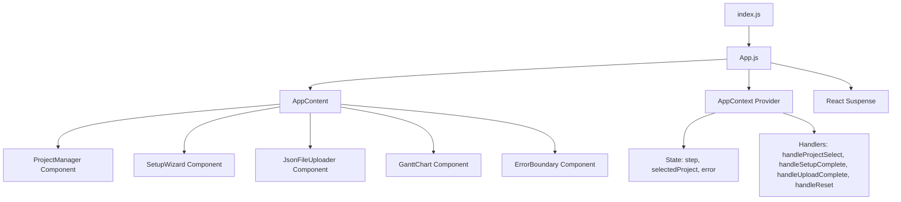

# Project Architecture Document

## Overview
This document provides a comprehensive overview of the architecture of the Project Management tool. It covers the main components, their responsibilities, interactions, and deployment considerations.

---

## 1. High-Level System Architecture



### Description
- The **Frontend** is a React application responsible for the user interface and user interactions.
- The **Backend API** exposes endpoints for the frontend to interact with the system.
- The **Services Layer** contains business logic and orchestrates operations, including logging and authentication services.
- The **Repositories** handle data access and persistence, interacting with JSON files and configuration files as the data storage.
- The **Models** define the data structures used throughout the backend.
- The **Installer GUI** provides a graphical interface for installation.
- The **Installer Scripts** automate building and deploying installers.
- The **State Management** in the frontend uses React Context API for shared state.

## 1.1 Detailed System Architecture



### Description
- The **UI Components** represent the React components responsible for rendering the user interface.
- The **Context Providers** manage shared state and context across the frontend.
- The **State Management** uses React Context API to maintain application state.
- The **API Service Layer** in the frontend handles communication with the backend API.
- The **Backend API** exposes endpoints for authentication, logging, and business logic services.
- The **Authentication Service** manages user authentication and authorization.
- The **Logging Service** handles application logging and monitoring.
- The **Business Logic Services** implement core application logic.
- The **Project Repository** and **User Repository** manage data access to JSON files.
- The **JSON Data Storage** represents the JSON files used as the data store.
- The **File System** is the underlying storage mechanism for JSON files.


---

## 2. Backend Architecture



### Description
- The **API Layer** includes files like `api.py`, `api_setup.py`, and `api_inputs.py` that define RESTful endpoints and API setup.
- `api.py` interacts with service modules such as `project_service.py` and `setup_service.py`.
- Service modules implement business logic and interact with repositories.
- The **Project Repository** manages data access to JSON files and configuration files.
- The **JSON Data Storage** represents the JSON files used as the data store.
- The **Configuration Files** store application configuration.
- The **File System** is the underlying storage mechanism for JSON files and configuration.

---


### Description
- The **ProjectService** class encapsulates business logic related to project management, including handling project data such as WBS levels, resources, allocations, and project start dates.
- The **SetupService** class manages project environment setup tasks, including git repository initialization, virtual environment creation, dependency installation, and JSON file uploads.
- The **ProjectRepository** class provides data access and persistence, managing project directories and JSON files.
- This layered architecture promotes separation of concerns, maintainability, and scalability by clearly defining responsibilities between service and repository layers.


---

## 3. Frontend Architecture



### Description
- `index.js` bootstraps the React application.
- `App.js` is the root component that wraps `AppContent` with `AppContext` provider and React `Suspense` for lazy loading.
- `AppContent` renders different components based on the current UI step managed in context:
  - `ProjectManager` for project selection and management.
  - `SetupWizard` for project setup steps.
  - `JsonFileUploader` for uploading project-related JSON files.
  - `GanttChart` for visualizing project timelines.
  - `ErrorBoundary` to catch and handle UI errors gracefully.
- `AppContext` provides state management using React Context API, maintaining:
  - `step`: current UI step (projectManager, setup, upload, dashboard).
  - `selectedProject`: currently selected project ID.
  - `error`: error message state.
  - Handlers to transition between steps and manage state.
- React `Suspense` is used to lazy load components for performance optimization.
- This architecture supports a state-driven UI flow with clear separation of concerns and robust error handling.


---

## 4. Deployment and Data Flow


### Description
- The user interacts with the frontend UI.
- The frontend sends API requests to the backend.
- The backend processes requests, interacts with JSON files for data storage, and returns responses.
- The frontend updates the UI based on backend responses.

---

## Additional Components

- **Installer GUI and Scripts**: Provide installation capabilities across platforms.
- **Documentation and Scripts**: Support development, testing, and deployment.
- **System Inputs**: Manage configuration and input data.


## Security


### JWT and API Key Management in Authentication Service
The Authentication Service manages user authentication and authorization using JWT (JSON Web Tokens) and API Keys. JWTs are issued upon successful login and are used to securely transmit user identity and claims. API Keys provide an additional layer of security for service-to-service communication. Tokens and keys are stored securely and validated on each request to protect against unauthorized access.

### Injection Protection and JSON Sanitization
To prevent injection attacks, especially in JSON inputs, the system employs strict input validation and sanitization mechanisms. All incoming JSON data is sanitized to remove or escape potentially malicious content, ensuring data integrity and security throughout the backend processing pipeline.

---

## Data Scalability

```mermaid
graph TD
    JSONFiles[Current JSON File Storage] --> Backend[Backend Services]
    Backend --> FutureDB[Future Database Migration (SQLite/SQLAlchemy)]
    Frontend[Frontend Application] --> IndexedDB[IndexedDB Caching]
```

### Future Migration to Databases
While the current system uses JSON files for data storage, future plans include migrating to a relational database such as SQLite with SQLAlchemy ORM. This migration will enhance data integrity, support complex queries, and improve scalability for larger datasets.

### IndexedDB Caching in Frontend
To optimize frontend performance and reduce server load, the use of IndexedDB is considered for caching project data locally in the browser. This approach enables offline capabilities and faster data retrieval, improving user experience.

---

## Frontend Optimization

```mermaid
graph TD
    ReactApp[React Application] --> ReactQuery[React Query for API State]
    ReactApp --> LazyLoad[Lazy Loading Components (e.g., GanttChart)]
```

### React Query for API State Management
React Query is utilized to manage API state efficiently, reducing boilerplate code and simplifying data fetching, caching, and synchronization with the backend. This improves frontend responsiveness and maintainability.

### Lazy Loading of Heavy Components
Heavy components such as the GanttChart are lazy loaded using React's Suspense and dynamic imports. This optimization reduces initial load time and improves application performance, especially on slower networks.

---

## Logging and Monitoring


### Log Structure
Logs are structured with clear levels (INFO, WARN, ERROR) and standardized formats including timestamps and context information. Log rotation and archival policies ensure efficient storage management and accessibility for troubleshooting.

### Alerting Pipeline
An alerting pipeline monitors log streams for critical errors and anomalies. Alerts are generated and routed to the development and operations teams via email or messaging platforms, enabling rapid response to issues.

---

## Testability


### Testing Strategy
The frontend is tested using Jest with component and integration tests to ensure UI correctness. The backend uses Pytest for unit and integration tests covering API endpoints and business logic.

### Mocking Strategy
Mocking is employed for dependent services and external APIs during testing to isolate components and simulate various scenarios, improving test reliability and coverage.

---

## Additional Notes


### Non-Functional Requirements
The system adheres to non-functional requirements including performance benchmarks, service level agreements (SLA), and reliability standards to ensure robust operation.

### Data Versioning Schema
A versioning schema is applied to JSON data files to track changes and support backward compatibility during updates.

### Error Handling Strategy
Error handling is consistently implemented across layers with clear propagation and user-friendly messaging, ensuring system stability and maintainability.

### Environment Management
Separate configurations and deployment pipelines are maintained for development, staging, and production environments to support safe and efficient releases.

---

## Summary

This architecture ensures modularity, scalability, and maintainability by separating concerns across frontend, backend, and deployment components. The use of React for the frontend and a layered backend architecture promotes clean code organization and ease of development.
