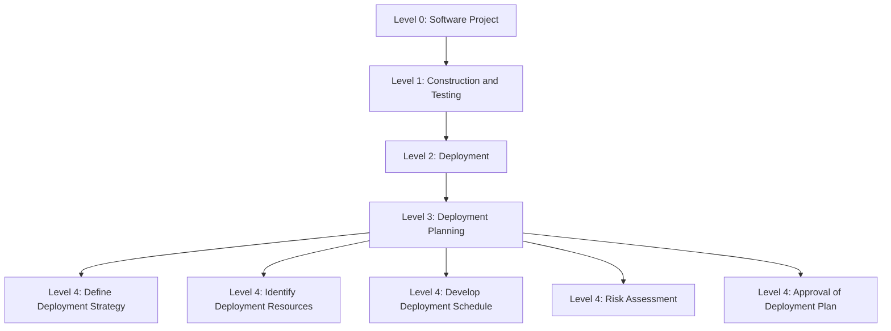
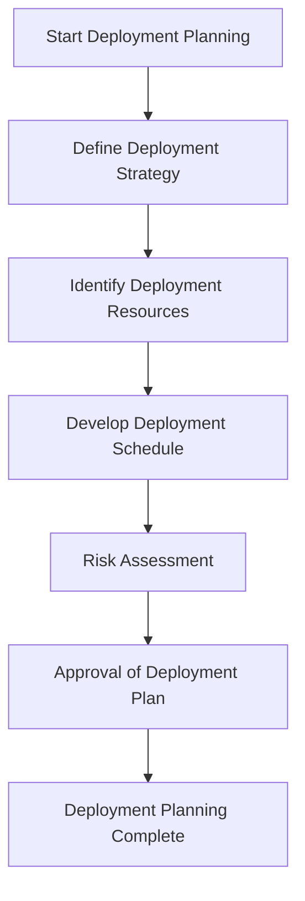

# Detailed Explanation of Deployment_Planning.json

This document provides a detailed explanation of the `Deployment_Planning.json` file located in the `Construction_and_Testing/Deployment` directory. This file is part of the Work Breakdown Structure (WBS) for the software project and describes the "Deployment Planning" phase within the Deployment category.

---

## File Purpose

The `Deployment_Planning.json` file defines the tasks involved in planning deployment activities and schedule. It breaks down the deployment planning into manageable subtasks to facilitate planning, execution, and tracking.

---

## JSON Structure Breakdown

- **id**: `"WBS-Construction-4.1"`  
  Unique identifier for this WBS element, indicating it belongs to the Construction and Testing phase and is the 4.1 task.

- **name**: `"Deployment Planning"`  
  The name of this task.

- **description**: `"Plan deployment activities and schedule."`  
  A brief description of the task's purpose.

- **level_0** to **level_3**:  
  These fields represent the hierarchical levels of the task within the overall project:  
  - `level_0`: "Software Project" (top-level project)  
  - `level_1`: "Construction and Testing" (major phase)  
  - `level_2`: "Deployment" (sub-phase)  
  - `level_3`: "Deployment Planning" (current task)

- **subtasks**: An array of subtasks that further break down the deployment planning task. Each subtask has:  
  - `id`: Unique identifier for the subtask (e.g., `"WBS-Construction-4.1.1"`)  
  - `name`: Name of the subtask (e.g., `"Define Deployment Strategy"`)  
  - `description`: Description of the subtask's purpose  
  - `level_4`: Hierarchical level name for the subtask  
  - `subtasks`: An empty array indicating no further breakdown for these subtasks

---

## Subtasks Description

1. **Define Deployment Strategy**  
   Establish the approach and methods for deployment.

2. **Identify Deployment Resources**  
   Determine the resources required for deployment activities.

3. **Develop Deployment Schedule**  
   Create a timeline for deployment activities.

4. **Risk Assessment**  
   Identify and evaluate risks related to deployment.

5. **Approval of Deployment Plan**  
   Obtain necessary approvals for the deployment plan.

---

## How to Use This File

- This file serves as an input to project management tools to organize and track deployment planning tasks.
- Each subtask can be assigned to team members, scheduled, and monitored.
- The hierarchical structure allows for clear visibility of task dependencies and progress.

---

## Extending the Structure

- This file covers the WBS structure up to level 4, which represents common tasks shared across many software projects.
- To tailor the WBS to your specific project goals, you should further break down each level 4 subtask into three additional levels (e.g., `level_5`, `level_6`, `level_7`).
- These additional levels should be created based on the unique requirements and details of your project.
- When adding these levels, maintain consistent `id` and `level_n` naming conventions to preserve the hierarchy.
- This approach allows you to customize the WBS JSON files to fit your project's specific needs while leveraging the common foundational structure provided.

---

This detailed explanation should help users understand the role and structure of the `Deployment_Planning.json` file, how it fits into the overall project WBS, and how to extend it to meet specific project requirements.

