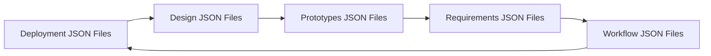
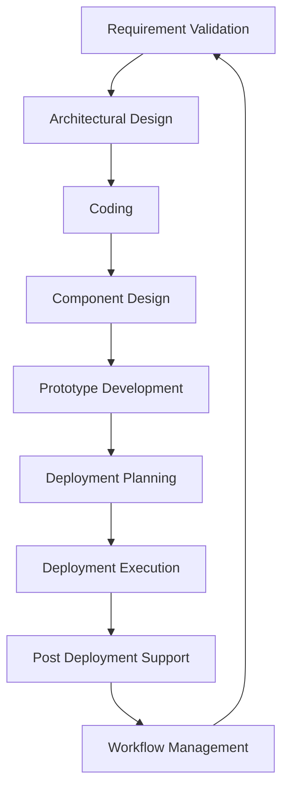

# JSON File Relationships in Project Management Software

This document illustrates the relationships and interactions between the
various JSON files used in the Project Management software. Understanding these
relationships helps in comprehending the data flow and dependencies within the
system.

- - -
## Overview of JSON Files

The JSON files are organized into several categories representing different
aspects of the project management process:

- **Deployment**: Files related to deployment planning, execution, and
  post-deployment support.
- **Design**: Files covering architectural design, coding, component design, and
  document analysis.
- **Prototypes**: Files related to prototype development, planning, refinement,
  and testing.
- **Requirements**: Files for requirement validation, workshops, and stakeholder
  interviews.
- **Workflow**: Files managing commit processes, task databases, JSON input
  usage, and detailed workflows.

- - -
## Diagram 1: High-Level JSON File Category Relationships

- - -
## Diagram 2: Detailed JSON File Interaction Flow

- - -
## Explanation

- The system starts with **Requirements** gathering and validation.
- Based on requirements, the **Design** phase defines architecture, coding, and
  component design.
- **Prototypes** are developed and refined to validate design choices.
- **Deployment** planning and execution follow, with post-deployment support
  ensuring system stability.
- The **Workflow** manages ongoing processes, commit tracking, and task
  management.
- The cycle continues iteratively to support project evolution and maintenance.

- - -
This document aims to provide a clear understanding of how JSON files
interrelate within the Project Management software, facilitating better data
management and system comprehension.

