# Detailed Test Execution Plan for ProjectManagement System

_Last updated: 2025-07-27_

---

## Objective

This document provides a professional, detailed, and sequential plan for executing all types of tests on the ProjectManagement system. Each test type folder's README file should be completed with detailed activities, document reviews, and granular test cases.

---

## Test Execution Steps

### Step 1: Preparation and Documentation Review

- Review and complete the README.md file in each test type folder under `Tests/TestingCode`.
- Ensure each README includes:
  - Description of the test type and its objectives.
  - Detailed activities involved in the test type.
  - Reference to the corresponding test documentation in `Tests/TestingDocs`.
  - A detailed list of test cases to be executed.

### Step 2: Unit Testing

- Complete the README.md file in `Tests/TestingCode/UnitTests` with detailed activities and test cases.
- Review the Unit Testing documentation in `Tests/TestingDocs/Unit_Testing.md`.
- Execute unit tests in `Tests/TestingCode/UnitTests`.
- Verify individual components and functions.
- Record results and update the Unit Testing documentation.

#### Unit Testing Workflow

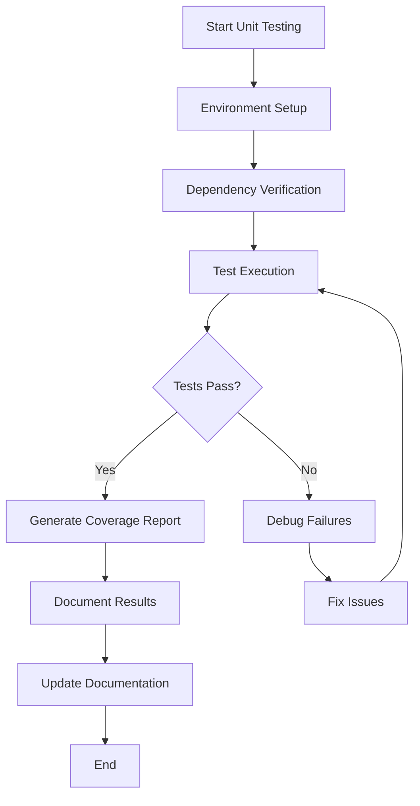

### Step 3: Integration Testing

- Complete the README.md file in `Tests/TestingCode/IntegrationTests` with detailed activities and test cases.
- Review the Integration Testing documentation in `Tests/TestingDocs/Integration_Testing.md`.
- Execute integration tests in `Tests/TestingCode/IntegrationTests`.
- Validate interactions between modules.
- Document results and update Integration Testing documentation.

#### Integration Testing Workflow

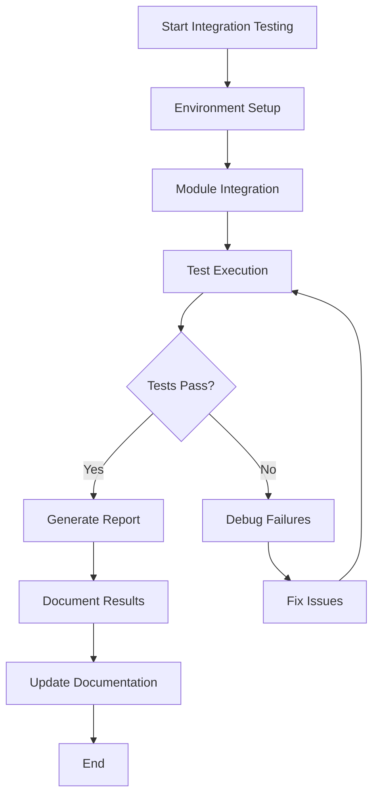

### Step 4: System Testing

- Complete the README.md file in `Tests/TestingCode/SystemTests` with detailed activities and test cases.
- Review the System Testing documentation in `Tests/TestingDocs/System_Testing.md`.
- Perform system tests in `Tests/TestingCode/SystemTests`.
- Confirm overall system functionality and performance.
- Update System Testing documentation accordingly.

#### System Testing Workflow

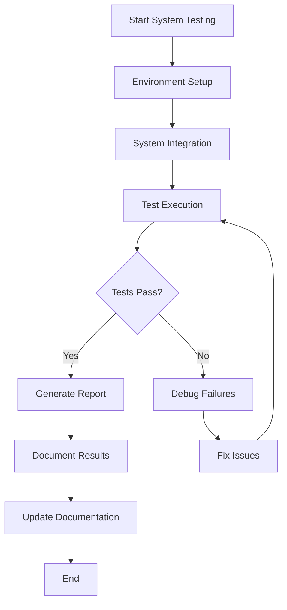

### Step 5: Acceptance Testing

- Complete the README.md file in `Tests/TestingCode/AcceptanceTests` with detailed activities and test cases.
- Review the Acceptance Testing documentation in `Tests/TestingDocs/Acceptance_Testing.md`.
- Conduct acceptance tests in `Tests/TestingCode/AcceptanceTests`.
- Ensure business requirements are met.
- Update Acceptance Testing documentation.

#### Acceptance Testing Workflow

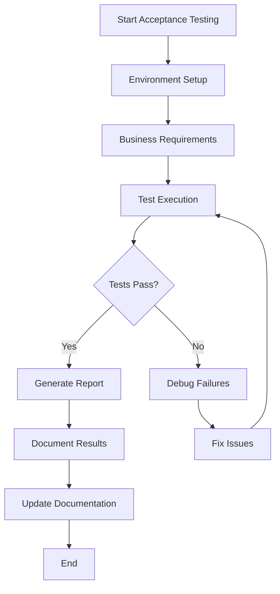

### Step 6: Regression Testing

- Complete the README.md file in `Tests/TestingCode/RegressionTests` with detailed activities and test cases.
- Review the Regression Testing documentation in `Tests/TestingDocs/Regression_Testing.md`.
- Run regression tests in `Tests/TestingCode/RegressionTests`.
- Verify no new defects introduced.
- Update Regression Testing documentation.

#### Regression Testing Workflow

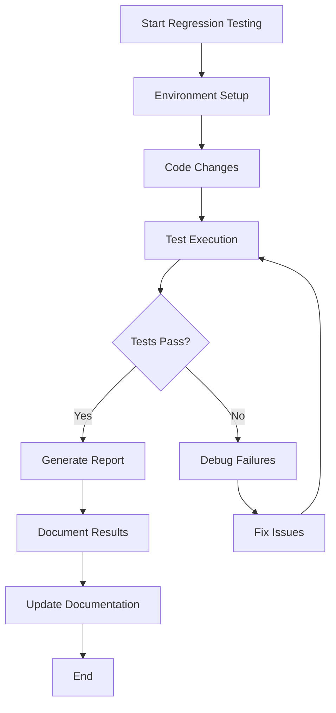

### Step 7: Performance Testing

- Complete the README.md file in `Tests/TestingCode/PerformanceTests` with detailed activities and test cases.
- Review the Performance Testing documentation in `Tests/TestingDocs/Performance_Testing.md`.
- Execute performance tests in `Tests/TestingCode/PerformanceTests`.
- Assess system responsiveness and stability.
- Update Performance Testing documentation.

#### Performance Testing Workflow

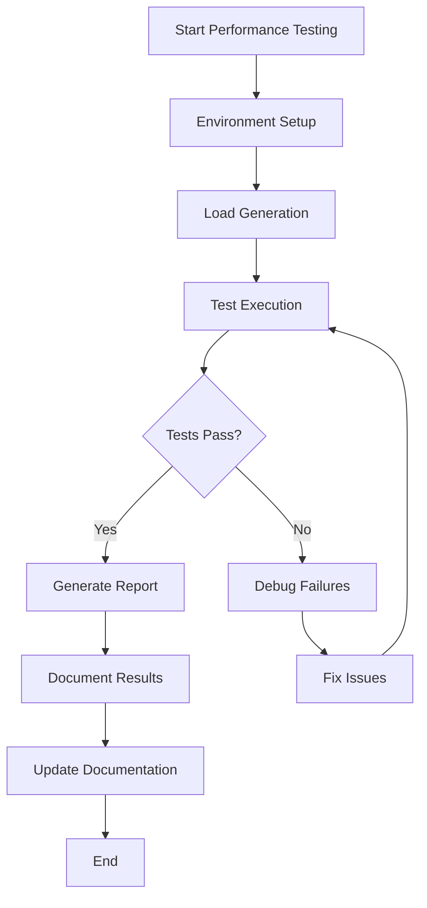

### Step 8: Security Testing

- Complete the README.md file in `Tests/TestingCode/SecurityTests` with detailed activities and test cases.
- Review the Security Testing documentation in `Tests/TestingDocs/Security_Testing.md`.
- Conduct security tests in `Tests/TestingCode/SecurityTests`.
- Identify vulnerabilities and verify protections.
- Update Security Testing documentation.

#### Security Testing Workflow

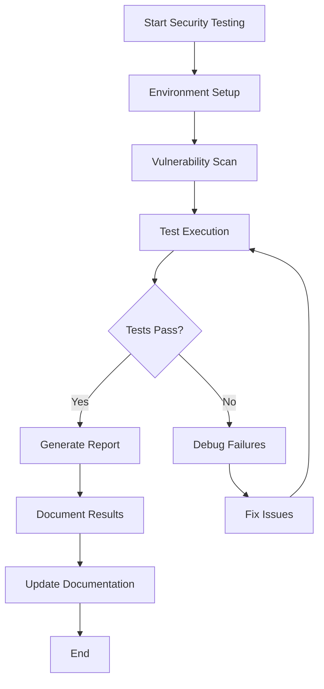

### Step 9: Documentation and Usability Testing

- Complete the README.md file in `Tests/TestingCode/DocumentationUsabilityTests` with detailed activities and test cases.
- Review the Documentation and Usability Testing documentation in `Tests/TestingDocs/Documentation_Usability_Testing.md`.
- Test documentation accuracy and usability in `Tests/TestingCode/DocumentationUsabilityTests`.
- Evaluate user interface and accessibility.
- Update Documentation and Usability Testing documentation.

#### Documentation and Usability Testing Workflow

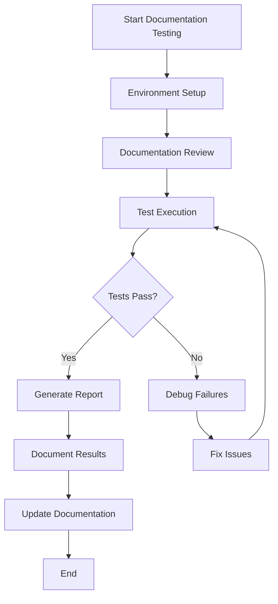

### Step 10: Shell Integration and Terminal Testing

- Complete the README.md file in `Tests/TestingCode/ShellIntegrationTerminalTests` with detailed activities and test cases.
- Review the Shell Integration and Terminal Testing documentation in `Tests/TestingDocs/Shell_Integration_Terminal_Testing.md`.
- Perform shell and terminal tests in `Tests/TestingCode/ShellIntegrationTerminalTests`.
- Verify terminal behavior and shell compatibility.
- Log results and update the Shell Integration and Terminal Testing checklist.

#### Shell Integration and Terminal Testing Workflow

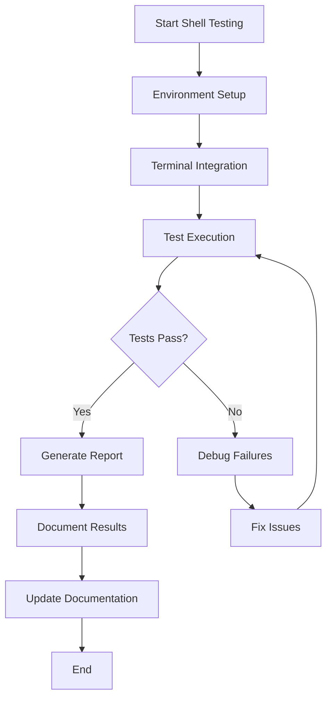

### Step 11: Environment Setup

- Set up the testing environment:
  - Create and activate a Python virtual environment.
  - Install all dependencies from `requirements.txt`.
  - Verify access to all test code directories.

#### Overall Testing Process

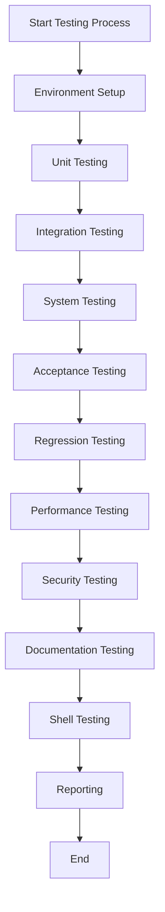

#### Test Types Distribution

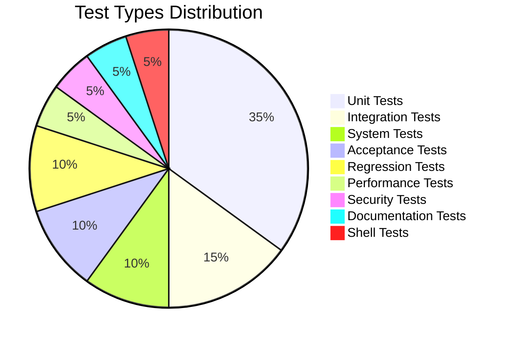

---

## Reporting and Continuous Improvement

- After each test phase, use the update script to refresh test documentation with pass/fail status and timestamps.
- Review failures and coordinate fixes.
- Repeat testing cycles until all tests pass.

---

## Summary

This plan ensures a professional, thorough, and traceable testing process. Completing README files with detailed activities and test cases is essential before executing tests.

