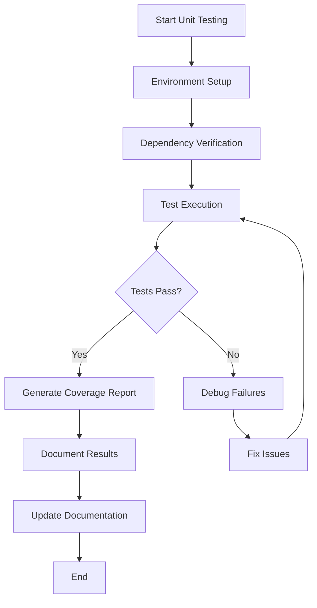
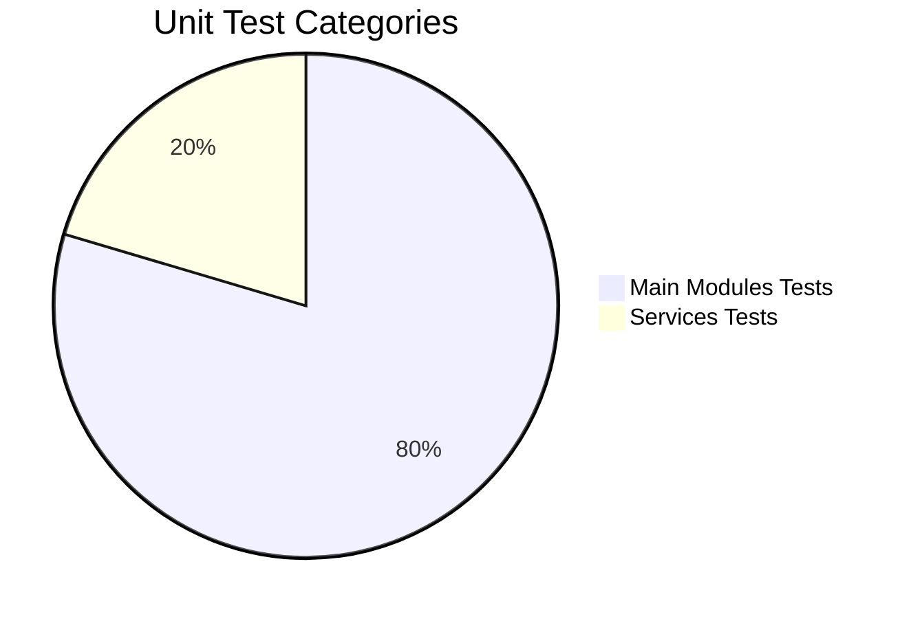
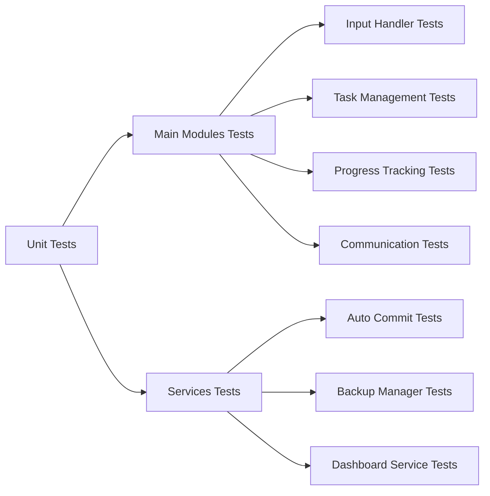

# Unit Tests

This directory contains unit test code for the ProjectManagement system.

Unit tests verify the smallest testable parts of the software in isolation, such as functions, methods, or classes.

Please organize your unit test scripts here.

---

## Overview

Unit tests are designed to verify the correctness of individual components in isolation. This includes functions, methods, and classes within the backend modules.

---

## Organization

- Test files are organized to mirror the source code structure:
  - `test_main_modules/` for tests related to `project_management.modules.main_modules`
  - `test_services/` for tests related to `project_management.modules.services`

---

## Test Structure

### Main Modules Tests (39 files)
- Core functionality tests
- Input validation tests
- Task management tests
- Progress tracking tests
- Communication feature tests
- Estimation feature tests
- Resource management tests
- Risk assessment tests
- Quality assurance tests
- Reporting functionality tests

### Services Tests (10 files)
- Auto commit functionality tests
- Backup management tests
- Task service tests
- Progress management service tests
- Dashboard service tests
- Data collection service tests

---

## Running Tests

- Use `pytest` or `unittest` to run tests.
- Ensure the `PYTHONPATH` includes the `project_management` directory.
- Example command:

```bash
PYTHONPATH=project_management pytest Tests/TestingCode/UnitTests/
```

### Running Individual Test Files

```bash
# Run a specific test file
PYTHONPATH=project_management pytest Tests/TestingCode/UnitTests/test_main_modules/test_input_handler.py

# Run all main modules tests
PYTHONPATH=project_management pytest Tests/TestingCode/UnitTests/test_main_modules/

# Run all services tests
PYTHONPATH=project_management pytest Tests/TestingCode/UnitTests/test_services/
```

### Running Tests with Coverage

```bash
# Run all unit tests with coverage
PYTHONPATH=project_management python -m pytest Tests/TestingCode/UnitTests/ --cov=. --cov-report=html:htmlcov_all --cov-report=term-missing --cov-config=.coveragerc
```

---

## Unit Testing Workflow



## Test Categories Distribution



## Test Execution Flow



---

## Test Results Documentation

After running tests, document results in:
- `test_results.md` - Summary of test results
- `test_results.xml` - Detailed test results in XML format
- `htmlcov_all/` - HTML coverage reports

---

## Updating Test Documentation

- After running tests and fixing issues, update `DETAILED_TEST_PLAN.md` and this README to reflect current test coverage and status.
- Record pass/fail status for each test file
- Document any issues or failures with detailed logs
- Update coverage metrics and reports
    J --> K[End]
PYTHONPATH=project_management pytest Tests/TestingCode/UnitTests/
