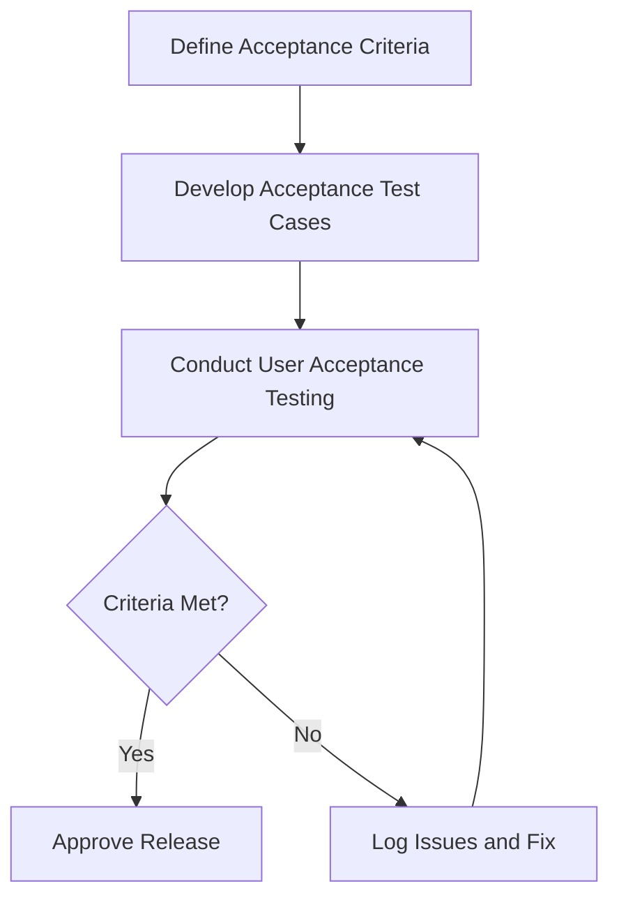

# Acceptance Testing for ProjectManagement System

_Last updated: 2025-07-27_

---

## Overview

Acceptance testing ensures the software meets business requirements and is ready for delivery. It validates the system from the end-user perspective.

---

## Testing Strategy

- Conduct User Acceptance Testing (UAT) with real user scenarios.
- Perform Contract Acceptance Testing to verify compliance.
- Use manual testing primarily, with documented test cases.
- Focus on usability, stability, and requirement fulfillment.

---

## Test Categories and Cases

### 1. User Acceptance Testing (UAT)

#### 1.1 Scenario Validation

- Validate key user scenarios and workflows.
- Confirm installation and setup meet user expectations.

#### 1.2 Documentation and Help

- Test error messages and help documentation clarity.
- Verify user guides and manuals.

#### 1.3 Stability and Usability

- Verify overall system stability and usability.
- Confirm user satisfaction.

### 2. Contract Acceptance Testing

#### 2.1 Compliance Verification

- Verify compliance with contractual requirements.
- Confirm delivery of all specified features.

#### 2.2 External Integration

- Test integration with external systems if applicable.

---

## Diagrams

### Acceptance Testing Workflow

---

## Tools and Frameworks

- Manual testing with documented test cases.
- User feedback and surveys.

---

## Reporting

- Document acceptance test results.
- Record user feedback and issues.
- Update acceptance criteria and test cases as needed.

---

This document provides a detailed guide for acceptance testing the ProjectManagement system.
