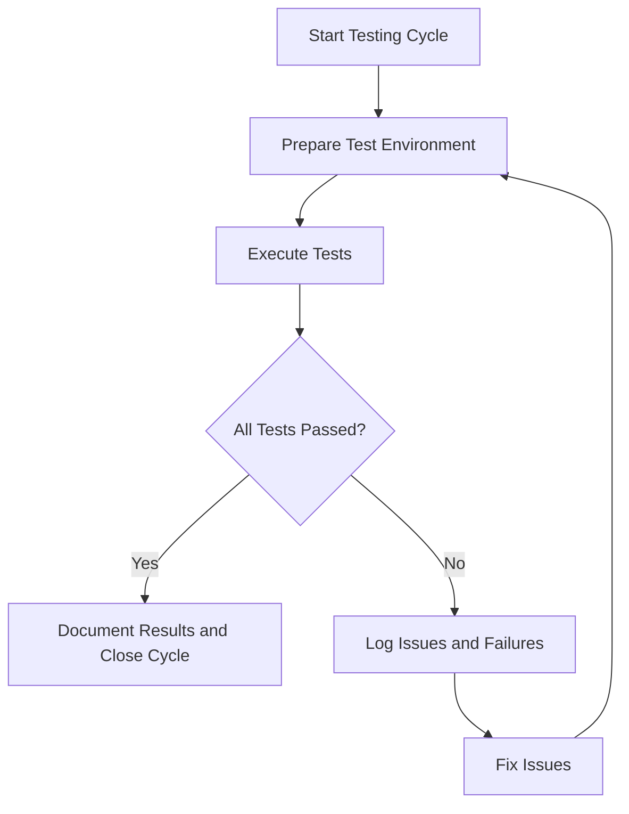

# Comprehensive Testing Process and Plan

_Last updated: 2025-07-27_

---

## 1. Introduction and Testing Process Overview

This document provides a complete and detailed guide to the testing process for the ProjectManagement system. It covers the types of tests to be performed, the process flow for testing, recording test executions, and reporting results. The goal is to ensure high quality, reliability, and maintainability of the software through rigorous and repeatable testing.

Testing is an iterative process of running tests, identifying issues, fixing them, and re-running tests until all tests pass successfully. This document also includes diagrams to visualize the testing workflow and a comprehensive checklist covering all modules and test types.

---

## 2. Detailed Testing Process with Diagrams

### 2.1 Testing Workflow Overview

### 2.2 Explanation

- **Prepare Test Environment:** Set up virtual environments, dependencies, and configurations as per the instructions.
- **Execute Tests:** Run automated and manual tests according to the test plan.
- **All Tests Passed?:** Check if all tests have passed.
- **Log Issues and Failures:** Record any failed tests with detailed information.
- **Fix Issues:** Developers address the issues found.
- **Document Results and Close Cycle:** Once all tests pass, document the results and conclude the testing cycle.

This cycle repeats until the software meets the quality standards.

---

## 3. Comprehensive Test Categories and Checklist

This section expands the testing process to include up to six levels of test categorization and detail, aligned with Pressman's "Software Engineering" testing framework. The tests are deeply categorized with detailed subcategories and specific test cases for the ProjectManagement system.

### 3.1 Unit Testing

Unit testing focuses on verifying the smallest testable parts of the software, such as functions, methods, or classes, in isolation.

#### 3.1.1 Backend Unit Tests

##### 3.1.1.1 Service Function Tests

- [ ] Test individual backend service functions for correct output.
- [ ] Verify edge cases and boundary conditions.
- [ ] Confirm exception handling and error messages.

##### 3.1.1.2 Data Validation Tests

- [ ] Verify data validation logic in models and services.
- [ ] Test input sanitization and format checks.
- [ ] Confirm rejection of invalid data.

##### 3.1.1.3 Error Handling Tests

- [ ] Test error handling in backend modules.
- [ ] Verify logging of errors and exceptions.
- [ ] Confirm recovery from failures.

##### 3.1.1.4 Repository Interaction Tests

- [ ] Confirm correct interaction with repositories and databases.
- [ ] Test CRUD operations for data integrity.
- [ ] Verify transaction management.

#### 3.1.2 Frontend Unit Tests

##### 3.1.2.1 Component Rendering Tests

- [ ] Test React components render correctly with various props.
- [ ] Verify conditional rendering and dynamic content.
- [ ] Confirm accessibility compliance.

##### 3.1.2.2 State and Event Handling Tests

- [ ] Verify component state changes and event handling.
- [ ] Test user interactions and event callbacks.
- [ ] Confirm proper state updates and side effects.

##### 3.1.2.3 Utility Function Tests

- [ ] Test utility functions and hooks.
- [ ] Verify correct outputs for various inputs.
- [ ] Confirm error handling in utilities.

##### 3.1.2.4 UI Content Tests

- [ ] Confirm UI elements display expected content.
- [ ] Verify localization and formatting.
- [ ] Test responsiveness and layout.

#### 3.1.3 Installer Unit Tests

##### 3.1.3.1 GUI Component Tests

- [ ] Test installer GUI components for correct behavior.
- [ ] Verify layout and user input handling.
- [ ] Confirm accessibility features.

##### 3.1.3.2 Script Function Tests

- [ ] Verify installation script functions in isolation.
- [ ] Test individual installation steps.
- [ ] Confirm error handling in scripts.

##### 3.1.3.3 Error Handling Tests

- [ ] Test error handling in installation steps.
- [ ] Verify user notifications on failure.
- [ ] Confirm rollback mechanisms.

### 3.2 Integration Testing

Integration testing verifies the interaction between integrated units/modules to detect interface defects.

#### 3.2.1 Backend Integration Tests

##### 3.2.1.1 API Endpoint Tests

- [ ] Test API endpoints with multiple integrated backend services.
- [ ] Verify response correctness and status codes.
- [ ] Confirm error handling and edge cases.

##### 3.2.1.2 Database Interaction Tests

- [ ] Verify database interactions and data consistency.
- [ ] Test transaction integrity and rollback.
- [ ] Confirm data synchronization.

##### 3.2.1.3 Authentication and Authorization Tests

- [ ] Test authentication flows.
- [ ] Verify authorization rules and access control.
- [ ] Confirm session management.

##### 3.2.1.4 Error Propagation Tests

- [ ] Confirm error propagation across modules.
- [ ] Verify logging and alerting mechanisms.

#### 3.2.2 Frontend-Backend Integration Tests

##### 3.2.2.1 API Communication Tests

- [ ] Test frontend API calls and response handling.
- [ ] Verify data flow between frontend components and backend services.
- [ ] Confirm error handling and user notifications.

##### 3.2.2.2 UI Update Tests

- [ ] Test UI updates based on backend responses.
- [ ] Verify state synchronization.
- [ ] Confirm loading and error states.

##### 3.2.2.3 User Interaction Tests

- [ ] Test user interactions triggering backend calls.
- [ ] Verify feedback and notifications.
- [ ] Confirm input validation.

#### 3.2.3 Installer Integration Tests

##### 3.2.3.1 Full Installation Process Tests

- [ ] Test full installation process including environment setup.
- [ ] Verify integration of installer GUI with backend scripts.
- [ ] Confirm error handling and rollback mechanisms.

##### 3.2.3.2 Script and GUI Interaction Tests

- [ ] Test interaction between installation scripts and GUI.
- [ ] Verify synchronization and state management.

##### 3.2.3.3 Failure Recovery Tests

- [ ] Confirm rollback and recovery on installation failure.
- [ ] Verify user notifications and logs.

### 3.3 System Testing

System testing validates the complete and integrated software product to ensure it meets requirements.

#### 3.3.1 Functional Testing

##### 3.3.1.1 Feature Tests

- [ ] Test all user-facing features and workflows.
- [ ] Verify command line interface commands and options.
- [ ] Test report generation and dashboard displays.
- [ ] Confirm input file handling and validation.

##### 3.3.1.2 Workflow Tests

- [ ] Test end-to-end workflows.
- [ ] Verify data consistency across modules.
- [ ] Confirm error handling in workflows.

##### 3.3.1.3 Boundary and Edge Case Tests

- [ ] Test boundary conditions and edge cases.
- [ ] Verify system behavior under unusual inputs.

#### 3.3.2 Non-Functional Testing

##### 3.3.2.1 Performance Testing

- [ ] Test performance under expected and peak loads.
- [ ] Verify response times and throughput.

##### 3.3.2.2 Security Testing

- [ ] Verify security aspects including data protection.
- [ ] Test vulnerability to common attacks.

##### 3.3.2.3 Usability Testing

- [ ] Test usability and accessibility of UI components.
- [ ] Confirm compliance with accessibility standards.

##### 3.3.2.4 Compatibility Testing

- [ ] Confirm compatibility across supported platforms.
- [ ] Test installation and operation on different OS versions.

### 3.4 Acceptance Testing

Acceptance testing ensures the software meets business requirements and is ready for delivery.

#### 3.4.1 User Acceptance Testing (UAT)

##### 3.4.1.1 Scenario Validation

- [ ] Validate key user scenarios and workflows.
- [ ] Confirm installation and setup meet user expectations.

##### 3.4.1.2 Documentation and Help

- [ ] Test error messages and help documentation clarity.
- [ ] Verify user guides and manuals.

##### 3.4.1.3 Stability and Usability

- [ ] Verify overall system stability and usability.
- [ ] Confirm user satisfaction.

#### 3.4.2 Contract Acceptance Testing

##### 3.4.2.1 Compliance Verification

- [ ] Verify compliance with contractual requirements.
- [ ] Confirm delivery of all specified features.

##### 3.4.2.2 External Integration

- [ ] Test integration with external systems if applicable.

### 3.5 Regression Testing

Regression testing ensures that recent changes have not adversely affected existing functionality.

#### 3.5.1 Test Re-Execution

- [ ] Re-run unit, integration, and system tests after code changes.
- [ ] Verify bug fixes do not introduce new issues.

#### 3.5.2 Compatibility Testing

- [ ] Test backward compatibility with previous versions.

### 3.6 Performance Testing

#### 3.6.1 Load Testing

##### 3.6.1.1 Large Input Files

- [ ] Test performance with large input files.
- [ ] Monitor memory and CPU usage.

##### 3.6.1.2 Peak Load

- [ ] Test system behavior under peak load conditions.

#### 3.6.2 Responsiveness

##### 3.6.2.1 CLI Responsiveness

- [ ] Test responsiveness of CLI commands.

##### 3.6.2.2 UI Responsiveness

- [ ] Test responsiveness of frontend UI components.

### 3.7 Security Testing

#### 3.7.1 Data Security

##### 3.7.1.1 Sensitive Data Handling

- [ ] Test secure handling of sensitive data (e.g., secret keys).
- [ ] Verify encryption and access controls.

##### 3.7.1.2 Logging and Exposure

- [ ] Verify no sensitive data is logged or exposed.

### 3.8 Documentation and Usability Tests

#### 3.8.1 Help and Documentation

##### 3.8.1.1 Help Command

- [ ] Verify `auto_pm help` command displays accurate and complete information.

##### 3.8.1.2 Documentation Files

- [ ] Verify README and HELP.md files are up to date and clear.
- [ ] Test links and references in documentation.

### 3.9 Shell Integration and Terminal Tests

#### 3.9.1 Terminal Behavior

##### 3.9.1.1 Shell Launch

- [ ] Verify integrated terminal opens with correct shell on Linux.
- [ ] Verify integrated terminal opens with correct shell on macOS.
- [ ] Verify integrated terminal opens with correct shell on Windows.

#### 3.9.2 Terminal Issues

##### 3.9.2.1 Shell Integration

- [ ] Verify "Shell Integration Unavailable" issue is resolved.

##### 3.9.2.2 Command Output

- [ ] Verify command outputs are visible in the terminal.

##### 3.9.2.3 Reload and Restart

- [ ] Verify VSCode reload and terminal restart apply the shell settings correctly.

---

## 4. Recording Test Runs: Dates, Times, and Multiple Runs

It is important to keep detailed records of test executions, including multiple runs of the same test. This helps track stability over time and identify intermittent issues.

### 4.1 Test Run Record Table Example

| Test Description | Run # | Date       | Time     | Result | Notes               |
|------------------|-------|------------|----------|--------|---------------------|
| `auto_pm install`| 1     | 2025-07-20 | 10:00 AM | Pass   | Initial run         |
| `auto_pm install`| 2     | 2025-07-22 | 02:30 PM | Fail   | Missing dependency  |
| `auto_pm install`| 3     | 2025-07-23 | 11:15 AM | Pass   | Fixed dependency    |

### 4.2 Guidelines

- Record each test run with date and time.
- Include pass/fail status and any relevant notes.
- Maintain logs or screenshots for failed runs.
- Use a centralized test report document or system for aggregation.

---

## 5. Test Reporting and Documentation

- Document all test results clearly and concisely.
- Include environment details (OS, versions, configurations).
- Attach logs, screenshots, or other evidence for failures.
- Summarize test coverage and outstanding issues.
- Share reports with the development and QA teams regularly.

---

## 6. Iterative Test-Fix-Rerun Cycle Explanation

Testing is not a one-time activity but an iterative process:

1. Run tests and identify failures.
2. Analyze and fix the root causes.
3. Re-run tests to verify fixes.
4. Repeat until all tests pass.

This ensures continuous improvement and software quality.

---

## 7. Summary Checklist for Quick Reference

| Category                      | Completed |
|-------------------------------|-----------|
| Installation and Setup Tests   | [ ]       |
| CLI Tests                     | [ ]       |
| Input File Handling Tests     | [ ]       |
| Workflow and Reporting Tests  | [ ]       |
| Robustness and Error Handling | [ ]       |
| Performance Tests             | [ ]       |
| Security Tests               | [ ]       |
| Documentation and Usability  | [ ]       |
| Shell Integration and Terminal| [ ]       |

---

This comprehensive testing document aims to guide the entire testing lifecycle, ensuring thorough coverage, clear documentation, and continuous quality improvement.

