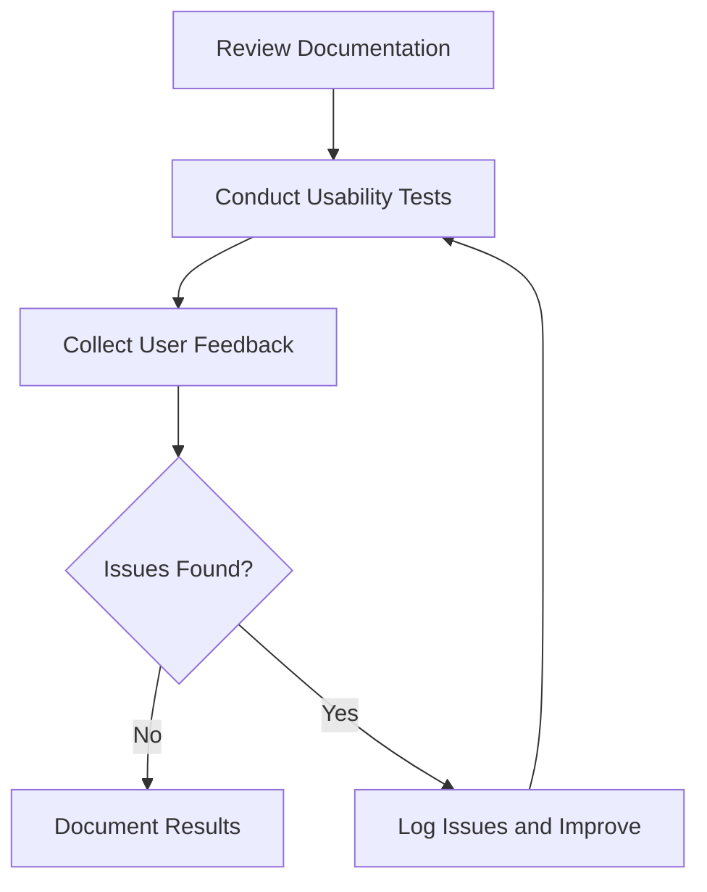

# Documentation and Usability Testing for ProjectManagement System

_Last updated: 2025-07-27_

---

## Overview

Documentation and usability testing ensures that the software documentation is accurate, complete, and user-friendly, and that the system is easy to use and accessible.

---

## Testing Strategy

- Verify accuracy and completeness of help commands and documentation files.
- Test usability and accessibility of the user interface.
- Collect user feedback to improve documentation and UI.
- Use manual testing and automated accessibility tools.

---

## Test Categories and Cases

### 1. Help and Documentation

#### 1.1 Help Command

- Verify `auto_pm help` command displays accurate and complete information.
- Confirm help messages are clear and concise.

#### 1.2 Documentation Files

- Verify README and HELP.md files are up to date and clear.
- Test links and references in documentation.
- Confirm consistency across documents.

### 2. Usability Testing

#### 2.1 User Interface Usability

- Test ease of navigation and task completion.
- Verify UI responsiveness and feedback.
- Confirm accessibility compliance (e.g., WCAG standards).

#### 2.2 User Feedback

- Collect and analyze user feedback.
- Identify usability issues and areas for improvement.

---

## Diagrams

### Documentation and Usability Testing Workflow

---

## Tools and Frameworks

- Accessibility testing tools: Axe, Lighthouse
- User feedback tools: Surveys, interviews

---

## Reporting

- Document usability test results and feedback.
- Track documentation updates and improvements.
- Update test cases as needed.

---

This document provides a detailed guide for documentation and usability testing the ProjectManagement system.
