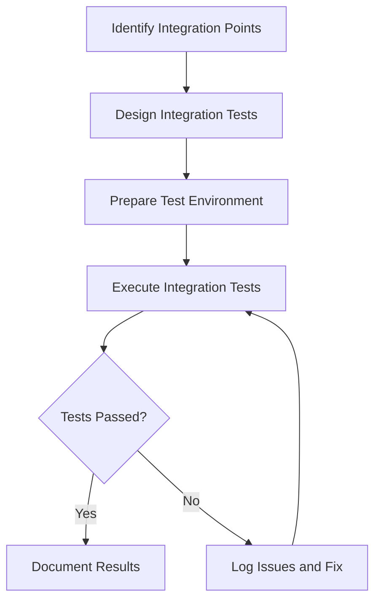

# Integration Testing for ProjectManagement System

_Last updated: 2025-07-27_

---

## Overview

Integration testing verifies the interaction between integrated units or modules to detect interface defects and ensure components work together as expected.

---

## Testing Strategy

- Test combined functionality of multiple modules.
- Use both automated and manual tests.
- Focus on data flow, API communication, and error propagation.
- Validate integration points and dependencies.

---

## Test Categories and Cases

### 1. Backend Integration Tests

#### 1.1 API Endpoint Tests

- Test API endpoints with multiple integrated backend services.
- Verify response correctness and status codes.
- Confirm error handling and edge cases.

#### 1.2 Database Interaction Tests

- Verify database interactions and data consistency.
- Test transaction integrity and rollback.
- Confirm data synchronization.

#### 1.3 Authentication and Authorization Tests

- Test authentication flows.
- Verify authorization rules and access control.
- Confirm session management.

#### 1.4 Error Propagation Tests

- Confirm error propagation across modules.
- Verify logging and alerting mechanisms.

### 2. Frontend-Backend Integration Tests

#### 2.1 API Communication Tests

- Test frontend API calls and response handling.
- Verify data flow between frontend components and backend services.
- Confirm error handling and user notifications.

#### 2.2 UI Update Tests

- Test UI updates based on backend responses.
- Verify state synchronization.
- Confirm loading and error states.

#### 2.3 User Interaction Tests

- Test user interactions triggering backend calls.
- Verify feedback and notifications.
- Confirm input validation.

### 3. Installer Integration Tests

#### 3.1 Full Installation Process Tests

- Test full installation process including environment setup.
- Verify integration of installer GUI with backend scripts.
- Confirm error handling and rollback mechanisms.

#### 3.2 Script and GUI Interaction Tests

- Test interaction between installation scripts and GUI.
- Verify synchronization and state management.

#### 3.3 Failure Recovery Tests

- Confirm rollback and recovery on installation failure.
- Verify user notifications and logs.

---

## Diagrams

### Integration Testing Workflow

---

## Tools and Frameworks

- Python: pytest, requests, unittest
- JavaScript/React: Jest, Cypress
- Installer: unittest, integration scripts

---

## Reporting

- Document integration test results with logs.
- Track issues and resolutions.
- Update integration test cases as system evolves.

---

This document provides a detailed guide for integration testing the ProjectManagement system components.
