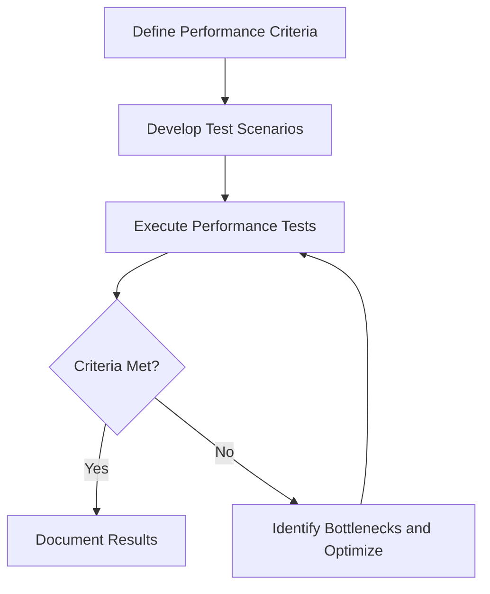

# Performance Testing for ProjectManagement System

_Last updated: 2025-07-27_

---

## Overview

Performance testing evaluates the system's responsiveness, stability, scalability, and resource usage under various conditions.

---

## Testing Strategy

- Test system behavior under normal and peak loads.
- Measure response times, throughput, and resource utilization.
- Identify bottlenecks and optimize performance.
- Use automated tools for load and stress testing.

---

## Test Categories and Cases

### 1. Load Testing

#### 1.1 Large Input Files

- Test performance with large input files.
- Monitor memory and CPU usage.

#### 1.2 Peak Load

- Test system behavior under peak load conditions.
- Verify system stability and responsiveness.

### 2. Responsiveness

#### 2.1 CLI Responsiveness

- Test responsiveness of CLI commands.

#### 2.2 UI Responsiveness

- Test responsiveness of frontend UI components.

---

## Diagrams

### Performance Testing Workflow

---

## Tools and Frameworks

- Load testing tools: JMeter, Locust
- Profiling tools: Python cProfile, Chrome DevTools
- Monitoring tools: Grafana, Prometheus

---

## Reporting

- Document performance metrics and test results.
- Track improvements and regressions.
- Update performance test cases as needed.

---

This document provides a detailed guide for performance testing the ProjectManagement system.
