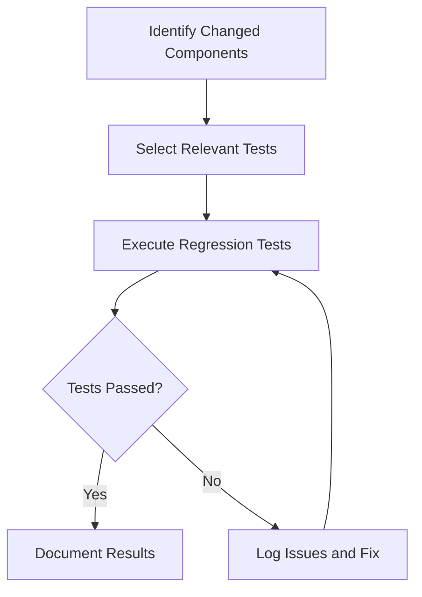

# Regression Testing for ProjectManagement System

_Last updated: 2025-07-27_

---

## Overview

Regression testing ensures that recent changes or bug fixes have not adversely affected existing functionality. It is critical for maintaining software stability over time.

---

## Testing Strategy

- Re-run existing unit, integration, and system tests after code changes.
- Automate regression tests where possible.
- Focus on areas impacted by recent changes.
- Maintain a regression test suite that grows with the project.

---

## Test Categories and Cases

### 1. Test Re-Execution

- Re-run all relevant unit tests.
- Re-run integration tests for affected modules.
- Execute system tests covering impacted workflows.
- Verify bug fixes do not introduce new issues.

### 2. Compatibility Testing

- Test backward compatibility with previous versions.
- Verify data migration and upgrade paths.

---

## Diagrams

### Regression Testing Workflow

---

## Tools and Frameworks

- Python: pytest, unittest
- JavaScript/React: Jest, Cypress
- Continuous Integration tools for automated regression testing.

---

## Reporting

- Document regression test results.
- Track recurring issues.
- Update regression test suite regularly.

---

This document provides a detailed guide for regression testing the ProjectManagement system.
