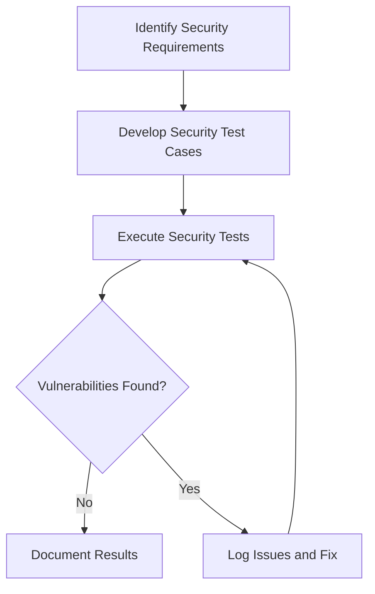

# Security Testing for ProjectManagement System

_Last updated: 2025-07-27_

---

## Overview

Security testing ensures that the system protects data and maintains functionality as intended, preventing unauthorized access and vulnerabilities.

---

## Testing Strategy

- Identify and test for common security vulnerabilities.
- Verify secure handling of sensitive data.
- Test authentication and authorization mechanisms.
- Use automated security scanning tools and manual penetration testing.

---

## Test Categories and Cases

### 1. Data Security

#### 1.1 Sensitive Data Handling

- Test secure handling of sensitive data (e.g., secret keys).
- Verify encryption and access controls.
- Confirm secure storage and transmission of data.

#### 1.2 Logging and Exposure

- Verify no sensitive data is logged or exposed.
- Test log sanitization and access restrictions.

### 2. Vulnerability Testing

- Test for SQL injection, XSS, CSRF, and other common attacks.
- Verify patching of known vulnerabilities.
- Conduct penetration testing.

### 3. Authentication and Authorization

- Test login and logout processes.
- Verify role-based access control.
- Confirm session management and timeout.

---

## Diagrams

### Security Testing Workflow

---

## Tools and Frameworks

- Security scanners: OWASP ZAP, Nessus
- Penetration testing tools: Metasploit
- Code analysis tools: SonarQube

---

## Reporting

- Document security test results and vulnerabilities.
- Track remediation progress.
- Update security test cases regularly.

---

This document provides a detailed guide for security testing the ProjectManagement system.
