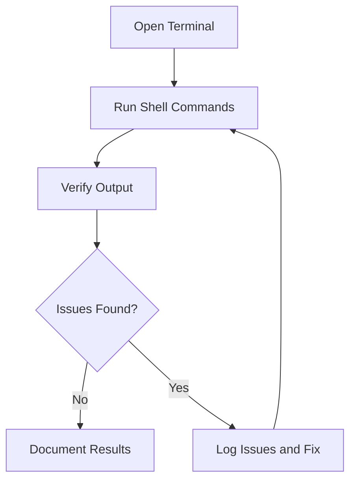

# Shell Integration and Terminal Testing for ProjectManagement System

_Last updated: 2025-07-27_

---

## Overview

Shell integration and terminal testing ensures that the system integrates correctly with various shell environments and that terminal behavior is as expected across platforms.

---

## Testing Strategy

- Verify shell launch and integration on supported operating systems.
- Test terminal command outputs and interaction.
- Confirm resolution of known shell integration issues.
- Use manual and automated tests where applicable.

---

## Test Categories and Cases

### 1. Terminal Behavior

#### 1.1 Shell Launch

- Verify integrated terminal opens with correct shell on Linux.
- Verify integrated terminal opens with correct shell on macOS.
- Verify integrated terminal opens with correct shell on Windows.

### 2. Terminal Issues

#### 2.1 Shell Integration

- Verify "Shell Integration Unavailable" issue is resolved.

#### 2.2 Command Output

- Verify command outputs are visible in the terminal.

#### 2.3 Reload and Restart

- Verify VSCode reload and terminal restart apply the shell settings correctly.

---

## Diagrams

### Shell Integration and Terminal Testing Workflow

---

## Tools and Frameworks

- Manual testing on Linux, macOS, and Windows.
- VSCode terminal integration testing.

---

## Reporting

- Document terminal test results.
- Track shell integration issues.
- Update test cases as needed.

---

This document provides a detailed guide for shell integration and terminal testing the ProjectManagement system.
