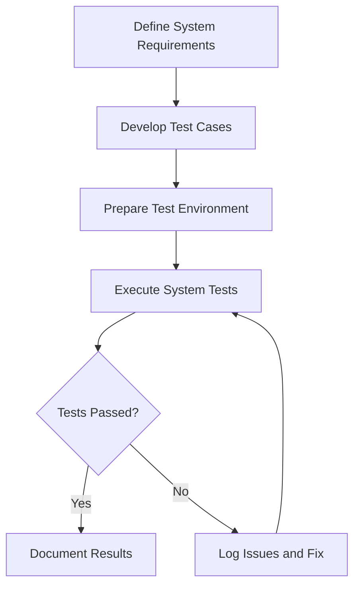

# System Testing for ProjectManagement System

_Last updated: 2025-07-27_

---

## Overview

System testing validates the complete and integrated software product to ensure it meets specified requirements, both functional and non-functional.

---

## Testing Strategy

- Perform end-to-end testing of the entire system.
- Include functional and non-functional tests.
- Use automated and manual testing methods.
- Validate system behavior under various conditions.

---

## Test Categories and Cases

### 1. Functional Testing

#### 1.1 Feature Tests

- Test all user-facing features and workflows.
- Verify command line interface commands and options.
- Test report generation and dashboard displays.
- Confirm input file handling and validation.

#### 1.2 Workflow Tests

- Test end-to-end workflows.
- Verify data consistency across modules.
- Confirm error handling in workflows.

#### 1.3 Boundary and Edge Case Tests

- Test boundary conditions and edge cases.
- Verify system behavior under unusual inputs.

### 2. Non-Functional Testing

#### 2.1 Performance Testing

- Test performance under expected and peak loads.
- Verify response times and throughput.

#### 2.2 Security Testing

- Verify security aspects including data protection.
- Test vulnerability to common attacks.

#### 2.3 Usability Testing

- Test usability and accessibility of UI components.
- Confirm compliance with accessibility standards.

#### 2.4 Compatibility Testing

- Confirm compatibility across supported platforms.
- Test installation and operation on different OS versions.

---

## Diagrams

### System Testing Workflow

---

## Tools and Frameworks

- Python: pytest, Selenium
- JavaScript/React: Cypress, Selenium
- Installer: manual and automated scripts

---

## Reporting

- Document system test results comprehensively.
- Include logs, screenshots, and performance metrics.
- Track defects and resolutions.
- Update test cases as system evolves.

---

This document provides a detailed guide for system testing the ProjectManagement system.
