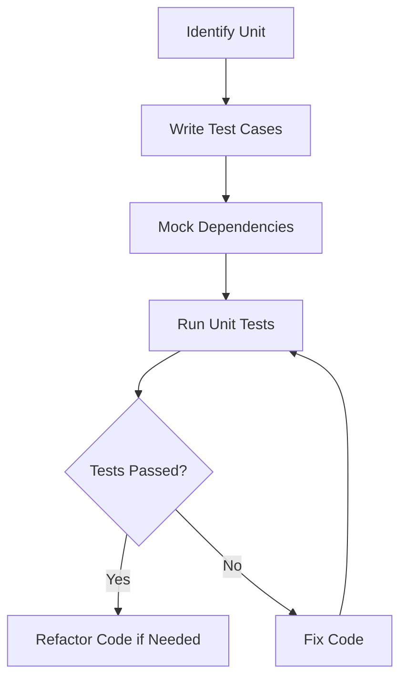

# Unit Testing for ProjectManagement System

_Last updated: 2025-07-27_

---

## Overview

Unit testing focuses on verifying the smallest testable parts of the software, such as functions, methods, or classes, in isolation. This ensures that each component behaves as expected independently.

---

## Testing Strategy

- Use automated testing frameworks (e.g., pytest for Python, Jest for React).
- Mock dependencies to isolate units.
- Cover normal cases, edge cases, and error handling.
- Maintain high code coverage.

---

## Test Categories and Cases

### 1. Backend Unit Tests

#### 1.1 Service Function Tests

- Test individual backend service functions for correct output.
- Verify edge cases and boundary conditions.
- Confirm exception handling and error messages.

#### 1.2 Data Validation Tests

- Verify data validation logic in models and services.
- Test input sanitization and format checks.
- Confirm rejection of invalid data.

#### 1.3 Error Handling Tests

- Test error handling in backend modules.
- Verify logging of errors and exceptions.
- Confirm recovery from failures.

#### 1.4 Repository Interaction Tests

- Confirm correct interaction with repositories and databases.
- Test CRUD operations for data integrity.
- Verify transaction management.

### 2. Frontend Unit Tests

#### 2.1 Component Rendering Tests

- Test React components render correctly with various props.
- Verify conditional rendering and dynamic content.
- Confirm accessibility compliance.

#### 2.2 State and Event Handling Tests

- Verify component state changes and event handling.
- Test user interactions and event callbacks.
- Confirm proper state updates and side effects.

#### 2.3 Utility Function Tests

- Test utility functions and hooks.
- Verify correct outputs for various inputs.
- Confirm error handling in utilities.

#### 2.4 UI Content Tests

- Confirm UI elements display expected content.
- Verify localization and formatting.
- Test responsiveness and layout.

### 3. Installer Unit Tests

#### 3.1 GUI Component Tests

- Test installer GUI components for correct behavior.
- Verify layout and user input handling.
- Confirm accessibility features.

#### 3.2 Script Function Tests

- Verify installation script functions in isolation.
- Test individual installation steps.
- Confirm error handling in scripts.

#### 3.3 Error Handling Tests

- Test error handling in installation steps.
- Verify user notifications on failure.
- Confirm rollback mechanisms.

---

## Diagrams

### Unit Testing Workflow

---

## Tools and Frameworks

- Python: pytest, unittest, mock
- JavaScript/React: Jest, React Testing Library
- Installer: unittest, mock

---

## Reporting

- Maintain test coverage reports.
- Document failed tests with logs and screenshots.
- Update test cases as code evolves.

---

This document provides a detailed guide for unit testing the ProjectManagement system components.
